The App Registry already supports **shared ownership**, even before a fully separate organization entity becomes the only publishing model.

Today, the key concept is the `owners` field in the manifest.

## Current model

Each app manifest can declare multiple owners:

```json
{
  "owners": [
    { "type": "author", "id": "did:key:alice" },
    { "type": "author", "id": "did:key:bob" }
  ]
}
```

That means:

- more than one key can publish new versions,
- ownership can be transferred by changing the manifest in a signed release,
- a team does not need to share one private key just to collaborate.

## Why this matters

For teams, shared ownership solves two important problems:

| Problem | Better model |
| --- | --- |
| One maintainer becomes a bottleneck | Multiple maintainers can publish |
| A single shared private key becomes risky | Each maintainer keeps an individual signing key |

This is safer operationally and cleaner from an audit perspective.

## Planned organization model

The design notes in `ORGANIZATIONS_DESIGN.md` outline a stronger future model:

- organizations become first-class entities,
- an app is associated with one organization,
- organization membership and roles determine who can publish,
- ownership transitions are handled at the org layer rather than by editing a raw list forever.

The motivation is to keep manifests simpler while moving **policy** into registry-managed metadata.

## Team workflow recommendations right now

### Small teams

- Give each maintainer their own signing identity.
- Use multiple owners in the manifest.
- Keep signing and release review in CI.

### Larger teams

- Treat manifest owners as a temporary compatibility layer.
- Document who is allowed to sign releases.
- Keep app source, manifest changes, and registry pushes behind pull request review.

### Emergency response

If one maintainer leaves or a key is compromised:

1. remove that owner in the next signed release,
2. rotate any related CI secrets,
3. republish a clean version,
4. update internal release procedures.

## Ownership lifecycle

```mermaid
flowchart LR
    CREATE[App created] --> OWNERS[Owners listed in manifest]
    OWNERS --> REVIEW[Team reviews release]
    REVIEW --> SIGN[Authorized maintainer signs]
    SIGN --> PUBLISH[Bundle published]
    PUBLISH --> ROTATE[Owner set can be changed in later signed release]

    classDef lime fill:#14210a,stroke:#a5ff11,color:#f5ffe0,stroke-width:2px;
    classDef cyan fill:#0b2526,stroke:#39d0c8,color:#dcfffd,stroke-width:2px;
    classDef purple fill:#221133,stroke:#c084fc,color:#f7ecff,stroke-width:2px;

    class CREATE,OWNERS lime;
    class REVIEW,SIGN cyan;
    class PUBLISH,ROTATE purple;
```



## Practical guidance

| Do | Avoid |
| --- | --- |
| Keep per-person signing keys | Sharing one private key over chat or password managers |
| Use CI checks to validate manifests before publish | Letting manual local steps be the only release process |
| Record ownership changes in git history and changelogs | Silent signer changes with no operational note |
| Plan toward org-based ownership | Hard-coding a single maintainer forever |

## What to expect over time

As the organization model matures, the user experience should improve in three ways:

1. clearer org-level permissions,
2. better onboarding and offboarding of maintainers,
3. simpler app metadata with less ownership policy embedded directly in every manifest.

## Recommended next reads

- [Registry Overview](/app-directory/registry-overview/)
- [Registry API & CLI](/app-directory/registry-api-and-cli/)
