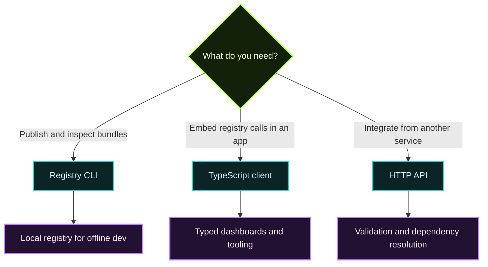

The App Registry exposes three main integration surfaces:

| Surface | Best for |
| --- | --- |
| **HTTP API** | Registry backends, custom automation, external integrations |
| **TypeScript client** | Web apps, admin tooling, scripted integrations in Node |
| **CLI** | Publishing, local testing, CI pipelines, and operator workflows |

## HTTP API at a glance

The v1 API specification describes a minimal registry service for storing and resolving signed manifests.

### Core endpoints

| Endpoint | Purpose |
| --- | --- |
| `POST /v1/apps` | Submit a manifest for validation and storage |
| `GET /v1/apps/:id` | List all known versions for an app |
| `GET /v1/apps/:id/:version` | Fetch a specific stored manifest |
| `GET /v1/search` | Search by app id, name, provided interfaces, or requirements |
| `POST /v1/resolve` | Produce a dependency installation plan |

### What the backend validates

- Manifest schema
- Semver formatting
- Digest formatting
- Signature validity using canonicalized JSON
- Artifact URI shape
- Optional artifact reachability checks

This makes the registry useful both as a **catalog** and as a **policy gate** during publishing.

## Client library

The TypeScript client library wraps the registry API with typed request helpers, retries, error handling, and configuration options.

```ts
import { CalimeroRegistryClient } from '@calimero-network/registry-client';

const client = new CalimeroRegistryClient({
  baseURL: 'https://api.calimero.network',
  apiKey: process.env.CALIMERO_API_KEY,
  timeout: 10_000,
});
```

Use the client when you want:

- typed app listing and lookup,
- reusable API auth/config,
- retries and error mapping,
- browser or Node integrations without manually managing request plumbing.

> **Note**
> Some examples in the client library README are broader than the minimal v1 manifest spec. When documenting production behavior, treat the registry backend and API spec as the canonical source of truth.
>

## CLI workflows

The CLI is the fastest way to work with the registry day-to-day.

### Common uses

| Task | CLI path |
| --- | --- |
| Configure endpoint and API token | `calimero-registry config ...` |
| Create and push bundles | `calimero-registry bundle ...` |
| Inspect or edit package metadata | `calimero-registry bundle get/edit ...` |
| Manage organizations | `calimero-registry org ...` |
| Run a local offline registry | `calimero-registry local ...` |

### Local registry mode

One of the most useful features is the **local registry** for development:

```bash
calimero-registry local start
calimero-registry apps list --local
calimero-registry health --local
```

This is especially helpful when you want to:

- test bundle submission without touching a shared environment,
- iterate on manifests and artifacts offline,
- rehearse publish/install flows in CI or local teams,
- seed test data and reset state quickly.

## Choosing the right interface



## Deployment split

The monorepo separates the registry into focused packages:

| Package | Role |
| --- | --- |
| `backend` | Validates manifests, stores metadata, exposes the API |
| `frontend` | Web UI for browsing, uploading, and managing packages |
| `client-library` | TypeScript wrapper around the API |
| `cli` | Operator and developer command surface |

That separation is useful when you only need one slice. For example, a hosted registry deployment may need the backend and frontend, while CI pipelines may only need the CLI.

## Recommended next reads

- [Registry Overview](/app-directory/registry-overview/) for the trust and bundle model
- [Organizations & Ownership](/app-directory/organizations-and-ownership/) for team publishing rules
- [Calimero Desktop](/tools-apis/desktop/) to understand how registry installs reach end users
