The **Calimero App Registry** is the distribution layer for Calimero applications. It lets teams publish signed WebAssembly bundles, browse available apps, and install them into nodes with a repeatable verification path.

Unlike a generic package index, the registry is opinionated about **bundle integrity**, **publisher identity**, and **installation-time re-verification**.

## What the registry actually stores

A published Calimero app is distributed as an `.mpk` bundle:

```text
bundle.mpk
├── manifest.json
├── app.wasm
└── abi.json        # optional
```

| Part | Purpose |
| --- | --- |
| `manifest.json` | Human-readable metadata plus the Ed25519 signature used for verification |
| `app.wasm` | The compiled application logic that runs inside `merod` |
| `abi.json` | Optional interface metadata used by tooling and generated clients |

## End-to-end trust path

```mermaid
flowchart LR
    DEV[Developer or team] --> SIGN[Sign manifest with mero-sign]
    SIGN --> PUSH[Push bundle to registry]
    PUSH --> VERIFY[Registry canonicalizes and verifies signature]
    VERIFY --> STORE[Manifest and artifact metadata stored]
    STORE --> DISCOVER[Desktop or CLI discovers app]
    DISCOVER --> INSTALL[Node installs bundle]
    INSTALL --> RECHECK[Desktop or node re-verifies signature and digest]

    classDef lime fill:#14210a,stroke:#a5ff11,color:#f5ffe0,stroke-width:2px;
    classDef cyan fill:#0b2526,stroke:#39d0c8,color:#dcfffd,stroke-width:2px;
    classDef purple fill:#221133,stroke:#c084fc,color:#f7ecff,stroke-width:2px;
    classDef orange fill:#2c1805,stroke:#ffb54d,color:#fff2d6,stroke-width:2px;

    class DEV,SIGN lime;
    class PUSH,VERIFY cyan;
    class STORE,DISCOVER purple;
    class INSTALL,RECHECK orange;
```



## Publish flow in practice

1. Build your application to WASM.
2. Generate or reuse an Ed25519 signing key with [`mero-sign`](/tools-apis/mero-sign/).
3. Create a bundle with the registry CLI.
4. Sign the manifest.
5. Push the bundle to the registry.
6. Browse and install it from [Calimero Desktop](/tools-apis/desktop/) or with CLI tooling.

The existing [App Directory overview](/app-directory/) covers the **author workflow**. This page explains the **system behavior** behind that workflow.

## Why the signature model matters

The registry README describes a strict verification path:

1. Remove the `signature` field and registry-added internal fields.
2. Canonicalize the manifest JSON into deterministic bytes.
3. Hash those bytes.
4. Verify the Ed25519 signature against the publisher public key.

That same idea runs again when a bundle is installed. This means the registry is not the only trust anchor. The **consumer side** also checks what was published.

## What the registry is responsible for

| Capability | What it means |
| --- | --- |
| Discovery | Users can browse available apps and versions |
| Validation | Malformed manifests and invalid signatures are rejected |
| Ownership checks | New versions and edits are gated by author or organization rules |
| Artifact resolution | The manifest points to the application artifact and its digest |
| Installability | Desktop and nodes can fetch, verify, and open apps consistently |

## What it is not

The registry is **not** the node runtime, the auth system, or the execution environment for app logic.

- `merod` runs the app.
- The registry distributes the app.
- Desktop provides user-facing install and launch flows.

## Recommended next reads

- [App Directory](/app-directory/) for publishing and featured app examples
- [Registry API & CLI](/app-directory/registry-api-and-cli/) for backend endpoints and automation surfaces
- [Organizations & Ownership](/app-directory/organizations-and-ownership/) for team publishing models
