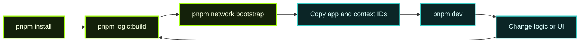

Welcome! This guide will get you building your first Calimero application as quickly as possible. We'll focus on **practical hands-on development** first - save the deep concepts for later. Let's build something.

## Builder Journey


## What You'll Need

Before we dive in, here are the tools we'll be using:

### Core Tools

- **`merod`** - The runtime that executes your Calimero applications. [Source code](https://github.com/calimero-network/core)

- **`merobox`** - Docker orchestration tool that makes it trivial to spin up local Calimero nodes (`merod` instances). [Source code](https://github.com/calimero-network/merobox)

- **`mero-devtools-js`** - JavaScript wrappers for Calimero tooling to keep your development workflow simple and consistent. [Source code](https://github.com/calimero-network/mero-devtools-js)

- **`@calimero-network/abi-codegen`** - Generates TypeScript clients from your Rust backend, keeping frontend/backend in sync.

Don't worry about installing these individually - the setup process will handle it.

## Choose Your Starting Point

Choose your adventure:

### 🤖 Path 1: AI-Assisted (Recommended)

Use AI to scaffold and build your app with context-aware assistance. This is our **recommended path** - it's the fastest way to go from idea to working app, and you'll learn the most along the way.

**Time:** 15-30 minutes  
**Best for:** Anyone who wants to learn while building

**→ Continue to the [AI-Assisted Walkthrough](#the-ai-assisted-path-walkthrough) below**

### ⚡ Path 2: Start with a Template or Example

Get started immediately with working code:

**Option A: Create from template**
```bash
npx create-mero-app@latest my-app
cd my-app
pnpm install
```

**Option B: Clone an example app**
```bash
# Clone the Battleships example
git clone https://github.com/calimero-network/battleships
cd battleships
pnpm install

```

**Time:** Variable  
**Best for:** Experienced developers who want to dive straight into code or learn by exploring working examples

After setup, follow the README instructions to build and run the app.

---

## Minimal Dev Loop

1. `pnpm install` — fetch dependencies for root and generated subdirectories.
2. `pnpm logic:build` — compile the Rust WASM and regenerate ABI clients.
3. `pnpm network:bootstrap` — start Merobox, deploy the WASM, capture the **Application ID**.
4. Update your frontend config with the Application ID and context ID.
5. `pnpm dev` — run React/Vite with hot reload alongside `logic:watch`.
6. Open two browser tabs, join the context, and iterate on gameplay or flows.

Keep this loop handy; the walkthrough below explains each step in detail and shows where the commands live.



---

## The AI-Assisted Path (Walkthrough)

This walkthrough uses **Cursor** (an AI-powered IDE) to build a complete Calimero application. We'll use the [Battleships game](https://github.com/calimero-network/battleships) as our example to show you exactly what happens at each step.

### Prerequisites

1. **Install Cursor** - [Download here](https://cursor.sh)
2. **Install Docker** - [Download here](https://www.docker.com/products/docker-desktop) (required for `merobox`)
3. **Have an idea** - Know what you want to build (or follow along with Battleships)
4. **Basic familiarity** - Know JavaScript/TypeScript and have seen Rust (don't need to be an expert)

### Step 1: Set Up Your Context

The key to AI-assisted development is giving the AI the right context. We've created a specialized prompt that teaches the AI about Calimero development patterns.

**Access the prompt:**  
[Calimero Bootstrap Prompt](https://gist.github.com/antonpaisov/270d609b43798a926f1755e4036319f5)

**In Cursor:**

1. Create a new folder for your project
2. Open it in Cursor
3. Open the AI chat panel (Cmd+L or Ctrl+L)
4. Copy the entire Calimero bootstrap prompt
5. Paste it into the chat

**What this does:** The prompt teaches the AI about:
- Calimero's architecture and patterns
- How to structure both Rust backend and React frontend
- Best practices for state management and validation
- Common pitfalls to avoid

### Step 2: Specify Your Application

Now tell the AI what you want to build. Be specific about:

- **Core functionality** - What does the app do?
- **User interactions** - How do users interact with it?
- **State management** - What data needs to be stored and shared?
- **Business rules** - What validation or game rules exist?

**Example (Battleships):**

> I want to build a multiplayer Battleships game on Calimero with these specs:
> 
> - 10x10 grid, standard fleet (carrier, battleship, cruisers, destroyer)
> - Players place ships privately before the game starts
> - Turn-based gameplay: propose shot → opponent acknowledges → resolve
> - Ships are only revealed when hit
> - First to sink all opponent ships wins
> - Need full validation (no adjacent ships, valid coordinates, etc.)
> - Modern React frontend with real-time updates

### Step 3: Understanding What the AI Does

Here's what happens when you hit enter. We'll break down each major phase:

#### Phase 1: Project Structure Setup

**What the AI does:**
```
battleships/
├── logic/              # Rust backend
│   ├── src/
│   │   └── lib.rs
│   └── Cargo.toml
├── app/                # React frontend  
│   ├── src/
│   │   └── App.tsx
│   └── package.json
├── workflows/          # Merobox configs
└── scripts/           # Build automation
```

**Why this structure:**

- `logic/` contains your Rust or TypeScript business logic compiled to WASM
- `app/` is your React frontend that calls into the WASM
- `workflows/` your local merobox configuration and workflow
- `scripts/` automates building, deploying, and testing

#### Phase 2: Domain Modeling (Rust Backend)

The AI starts by modeling your domain in Rust or TypeScript. For Battleships, this means:

**2.1 Core Types** (`board.rs`, `ships.rs`)

```rust
// Coordinates on the board
#[derive(BorshSerialize, BorshDeserialize, Clone, Copy, PartialEq, Eq)]
pub struct Coordinate {
    pub x: u8,
    pub y: u8,
}

// Ship types and their sizes
#[derive(Clone, Copy, PartialEq, Eq)]
pub enum ShipType {
    Carrier,      // 5 cells
    Battleship,   // 4 cells
    Cruiser,      // 3 cells (x2)
    Destroyer,    // 2 cells
}

// A ship with its coordinates
pub struct Ship {
    pub ship_type: ShipType,
    pub coordinates: Vec<Coordinate>,
}
```

**Why this matters:** These types form your "domain language". The AI chooses types that:

- Serialize efficiently
- Prevent invalid states at compile time (using enums)
- Are easy to validate and reason about

**2.2 Business Logic** (`game.rs`)

```rust
#[calimero::state]
pub struct GameState {
    pub matches: BTreeMap<String, Match>,
}

pub struct Match {
    pub player1: PlayerId,
    pub player2: PlayerId,
    pub current_turn: PlayerId,
    pub status: MatchStatus,
    pub pending_shot: Option<Shot>,
}

#[calimero::logic]
impl GameState {
    pub fn create_match(&mut self, player2: PlayerId) -> Result<String> {
        // Get the caller's identity (player1)
        let player1 = PublicKey::from_executor_id()?;
        
        // Validate players are different
        if player1 == player2 {
            return Err("Players must differ");
        }
        
        // Create match, emit event, return match_id
    }
    
    pub fn place_ships(&mut self, match_id: String, ships: Vec<Ship>) -> Result<()> {
        // Get caller's identity to verify they're a player
        let caller = PublicKey::from_executor_id()?;
        
        if !match_state.is_player(&caller) {
            return Err("Not a player in this match");
        }
        
        // Validate ship placement
        // Store privately (only visible to caller)
    }
    
    pub fn propose_shot(&mut self, match_id: String, target: Coordinate) -> Result<()> {
        // Get caller's identity to validate it's their turn
        let caller = PublicKey::from_executor_id()?;
        
        if match_state.current_turn != caller {
            return Err("Not your turn");
        }
        
        // Store pending shot
        // Wait for acknowledgment
    }
}
```

**What the AI does here:**

1. **Identifies state** - What needs to persist? (matches, players, boards)
2. **Defines operations** - What actions can users take? (create match, place ships, shoot)
3. **Uses identity** - Who is calling? (`PublicKey::from_executor_id()` gets the caller)
4. **Adds validation** - What rules must hold? (valid coords, ship placement rules, turn order)
5. **Implements authorization** - Is the caller allowed? (check if player, check if their turn)
6. **Implements privacy** - What should be hidden? (opponent's ships until hit)

**Why this pattern:** 

- `#[calimero::state]` - Marks your state struct for automatic persistence
- `#[calimero::logic]` - Exposes these methods as callable endpoints
- Each method is deterministic and validates inputs
- The AI structures this to prevent common bugs (race conditions, invalid states)

**2.3 Private Storage Pattern** (`players.rs`)

In Battleships, each player's ship placements must remain secret until they're hit. This is where Calimero's **private storage** comes in - data that's stored per-identity and not shared with other context members.

```rust
use calimero_sdk::app;
use calimero_storage::collections::UnorderedMap;

// Mark this struct as private storage
#[app::private]
#[derive(BorshSerialize, BorshDeserialize)]
pub struct PrivateBoards {
    pub boards: UnorderedMap<String, PlayerBoard>,
}

impl Default for PrivateBoards {
    fn default() -> PrivateBoards {
        PrivateBoards {
            boards: UnorderedMap::new(),
        }
    }
}

// In your game logic, use private storage:
pub fn place_ships(&mut self, match_id: &str, ships: Vec<String>) -> Result<()> {
    let caller = PublicKey::from_executor_id()?;
    
    // Load private storage for this caller only
    let mut priv_boards = PrivateBoards::private_load_or_default()?;
    let mut priv_mut = priv_boards.as_mut();
    
    // Get or create this player's board
    let key = match_id.to_string();
    let mut player_board = priv_mut.boards.get(&key)?.unwrap_or(PlayerBoard::new());
    
    // Place ships on the player's private board
    player_board.place_ships(ships)?;
    
    // Save back to private storage
    priv_mut.boards.insert(key, player_board)?;
    
    Ok(())
}
```

**What the AI does:**

1. **Marks data as private** - `#[app::private]` macro tells Calimero this is per-user storage
2. **Loads private data** - `PrivateBoards::private_load_or_default()` loads only the caller's data
3. **Stores per-player** - Each player has their own `PrivateBoards` instance
4. **Keeps secrets** - Player 1 cannot see Player 2's ship placements
5. **Validates privately** - Ship placement validation happens before storing

**Why this matters:**

- **Privacy** - Opponent can't peek at your ship locations
- **Security** - No way to cheat by reading other player's data
- **Simplicity** - Same API as regular storage, just add `#[app::private]`
- **Performance** - Private data doesn't get replicated to other nodes

**How it works:**

When `PublicKey::from_executor_id()` returns `player_1`, and they call `place_ships()`:
- Calimero loads the private storage **for player_1 only**
- Ships are stored in player_1's private space
- When player_2 calls the same method, they get **their own** private storage
- Neither player can access the other's data

This is the key mechanic that makes private information games like Battleships possible on Calimero.

**2.4 Identity and Authorization**

Every method call in Calimero knows **who is calling it**. This is fundamental for implementing permissions, ownership, and multi-player logic.

**Getting the Caller's Identity**

```rust
use calimero_sdk::env;

pub fn create_match(&mut self, player2: String) -> Result<String> {
    // Get the caller's identity (player 1)
    let player1 = PublicKey::from_executor_id()?;
    
    // player1 now contains the unique identifier of whoever called this method
    let player2_pk = PublicKey::from_base58(&player2)?;
    
    // Use identities for validation
    if player1 == player2_pk {
        return Err("Cannot play against yourself");
    }
    
    // Store players in match state
    let match_state = Match::new(match_id, player1, player2_pk);
    Ok(match_id)
}
```

**Authorization Patterns**

The AI implements several common authorization patterns:

**1. Ownership Checks**

```rust
pub fn place_ships(&mut self, match_id: &str, ships: Vec<String>) -> Result<()> {
    let caller = PublicKey::from_executor_id()?;
    let match_state = self.get_match(match_id)?;
    
    // Only players in this match can place ships
    if !match_state.is_player(&caller) {
        return Err("You are not a player in this match");
    }
    
    // Proceed with ship placement...
}
```

**2. Turn Validation**

```rust
pub fn propose_shot(&mut self, match_id: &str, x: u8, y: u8) -> Result<()> {
    let caller = PublicKey::from_executor_id()?;
    let match_state = self.get_match(match_id)?;
    
    // Only the current turn player can shoot
    if match_state.current_turn != caller {
        return Err("Not your turn");
    }
    
    // Proceed with shot...
}
```

**3. Target Identification**

```rust
pub fn acknowledge_shot(&mut self, match_id: &str) -> Result<String> {
    let caller = PublicKey::from_executor_id()?;
    let match_state = self.get_match(match_id)?;
    
    // Only the target player can acknowledge
    if match_state.pending_target != Some(caller) {
        return Err("This shot is not targeting you");
    }
    
    // Load caller's private board to resolve the shot
    let mut priv_boards = PrivateBoards::private_load_or_default()?;
    let mut player_board = priv_boards.boards.get(match_id)?;
    
    // Check if shot hits
    let result = resolve_shot(&mut player_board, shot_x, shot_y)?;
    Ok(result)
}
```

**Key Identity Functions**

- **`env::executor_id()`** - Returns the raw 32-byte identity of the caller
- **`PublicKey::from_executor_id()`** - Wraps the executor ID in a typed struct
- **`PublicKey::to_base58()`** - Converts identity to string for frontend display
- **`PublicKey::from_base58()`** - Parses identity from frontend input

**Why This Matters**

1. **Security** - Only authorized users can perform actions
2. **Multi-player** - Track which player is which in the game
3. **Privacy** - Private storage is keyed by identity
4. **Auditability** - Every action is tied to an identity
5. **Frontend integration** - Identities are passed between Rust and TypeScript

**Common Pattern**

```rust
#[app::logic]
impl GameState {
    pub fn some_action(&mut self, resource_id: String) -> Result<()> {
        // 1. Get caller identity
        let caller = PublicKey::from_executor_id()?;
        
        // 2. Load the resource
        let resource = self.get_resource(&resource_id)?;
        
        // 3. Check authorization
        if resource.owner != caller {
            return Err("Not authorized");
        }
        
        // 4. Perform action
        resource.do_something()?;
        
        // 5. Emit event with caller info
        app::emit!(ActionPerformed { 
            resource_id, 
            actor: caller.to_base58() 
        });
        
        Ok(())
    }
}
```

This pattern appears in every secure Calimero application: **identify → authorize → execute → audit**.

**2.5 Validation Strategy** (`validation.rs`)

```rust
pub trait PlacementValidator {
    fn validate(&self, ships: &[Ship], board: &Board) -> Result<()>;
}

pub struct ContiguousValidator;
impl PlacementValidator for ContiguousValidator {
    fn validate(&self, ships: &[Ship], board: &Board) -> Result<()> {
        // Check ships are straight lines
    }
}

pub struct NonAdjacentValidator;
impl PlacementValidator for NonAdjacentValidator {
    fn validate(&self, ships: &[Ship], board: &Board) -> Result<()> {
        // Check no ships touch
    }
}

// Compose validators
pub fn validate_placement(ships: &[Ship], board: &Board) -> Result<()> {
    let validators: Vec<Box<dyn PlacementValidator>> = vec![
        Box::new(ContiguousValidator),
        Box::new(NonAdjacentValidator),
        Box::new(FleetCompositionValidator),
    ];
    
    for validator in validators {
        validator.validate(ships, board)?;
    }
    Ok(())
}
```

**What the AI does:**

- Uses the **Strategy Pattern** to separate different validation concerns
- Makes it easy to add/remove rules without touching core logic
- Enables clear unit testing of each rule independently

**Why this matters:** Your game rules are complex. This pattern keeps them maintainable.

**2.4 Event System** (`events.rs`)

```rust
#[derive(BorshSerialize, BorshDeserialize)]
pub enum GameEvent {
    MatchCreated { match_id: String, players: (PlayerId, PlayerId) },
    ShipsPlaced { match_id: String, player: PlayerId },
    ShotProposed { match_id: String, shooter: PlayerId, target: Coordinate },
    ShotResolved { match_id: String, target: Coordinate, hit: bool, sunk: Option<ShipType> },
    MatchEnded { match_id: String, winner: PlayerId },
}

// Emit events from your logic
emit!(GameEvent::MatchCreated { 
    match_id: match_id.clone(),
    players: (player1, player2) 
});
```

**What the AI does:**

- Creates an event for each significant state change
- Emits events after successful operations
- Events are immutable and create an audit trail

**Why this pattern:**
- **Decoupling** - Frontend can react to events without polling
- **Debugging** - Full history of what happened
- **Future-proofing** - Easy to add analytics, monitoring, or replays

#### Phase 3: Frontend Integration (React)

Now the AI builds your React frontend to interact with the Rust backend.

**3.1 ABI Client Generation**

After the Rust code is written, the AI runs:

```bash
cargo build --target wasm32-unknown-unknown --release
npx calimero-abi-codegen -i logic/res/abi.json -o app/src/api/AbiClient.ts
```

**What this generates:**

```typescript
// Auto-generated TypeScript client
export class GameClient {
  async createMatch(player1: string, player2: string): Promise<string> {
    return this.call('create_match', { player1, player2 });
  }
  
  async placeShips(matchId: string, ships: Ship[]): Promise<void> {
    return this.call('place_ships', { match_id: matchId, ships });
  }
  
  async proposeShot(matchId: string, target: Coordinate): Promise<void> {
    return this.call('propose_shot', { match_id: matchId, target });
  }
  
  // ... other methods
}
```

**Why this is powerful:**

- **Type safety** - TypeScript knows about your Rust types
- **No manual sync** - Client updates automatically when you change data structures in logic
- **Autocomplete** - Your IDE knows all available methods

**3.2 React Components**

The AI creates a component structure like:

```typescript
// app/src/App.tsx
import { GameClient } from './api/AbiClient';

function App() {
  // IMPORTANT: Replace this with the Application ID from 'npm run network:bootstrap'
  const [clientAppId] = useState<string>('bafkreig3h5x7qnvz2h6k4y3wqz8r7...');
  
  const [gameClient, setGameClient] = useState<GameClient | null>(null);
  const [matches, setMatches] = useState<Match[]>([]);
  
  useEffect(() => {
    // Initialize Calimero client with Application ID
    const client = new GameClient({
      applicationId: clientAppId,  // From bootstrap output
      contextId: 'battleships-game',
      nodeUrl: 'http://localhost:2428',
      // ... other config
    });
    setGameClient(client);
  }, [clientAppId]);
  
  // Component logic...
}

// app/src/components/Board.tsx
function Board({ onCellClick, shots, ships }) {
  return (
    <div className="board">
      {[...Array(10)].map((_, row) =>
        [...Array(10)].map((_, col) => (
          <Cell 
            key={`${row}-${col}`}
            onClick={() => onCellClick({x: col, y: row})}
            isShip={hasShip(ships, col, row)}
            isHit={hasHit(shots, col, row)}
          />
        ))
      )}
    </div>
  );
}
```

**What the AI does:**

1. **Captures Application ID** - Placeholder for the ID from `npm run network:bootstrap`
2. **Initializes Calimero connection** - Sets up the client with Application ID and context
3. **Creates game UI** - Board, ship placement, shot selection
4. **Handles events** - Subscribes to game events for real-time updates
5. **Manages state** - React state synchronized with blockchain state

**Critical Step:** After running `pnpm network:bootstrap`, you'll see output like:

```
📋 Context created successfully!
   Application ID: bafkreig3h5x7qnvz2h6k4y3wqz8r7...
```

Copy this Application ID and replace the placeholder in `App.tsx`. Without this, your frontend won't connect to your deployed application!

**3.3 Real-time Updates**

```typescript
// Subscribe to events
useEffect(() => {
  if (!gameClient) return;
  
  const unsubscribe = gameClient.onEvent((event) => {
    if (event.type === 'ShotResolved') {
      // Update board with hit/miss
      updateBoard(event.data.target, event.data.hit);
      
      if (event.data.sunk) {
        showNotification(`You sunk their ${event.data.sunk}!`);
      }
    }
  });
  
  return unsubscribe;
}, [gameClient]);
```

**Why this pattern:**

- **Instant feedback** - No polling, events push updates immediately
- **Efficient** - Only updates when state actually changes
- **Scalable** - Works the same with 2 players or 200

#### Phase 4: Local Development Setup

The AI creates scripts and configs for local testing:

**4.1 Merobox Workflow** (`workflows/local-network.yml`)

```yaml
name: Battleships Local Network

nodes:
  - name: node-1
    port: 2428
    admin_port: 2528
  - name: node-2  
    port: 2429
    admin_port: 2529

contexts:
  - name: battleships-game
    application:
      path: ../logic/target/wasm32-unknown-unknown/release/battleships.wasm
    members:
      - node-1
      - node-2
```

**What this defines:**

- Two local Calimero nodes (one for each player)
- A shared "context" where the game runs
- Port mappings for connecting your frontend

**Understanding Contexts**

Before moving on, let's explain what a **context** actually is - this is a core Calimero concept that ties everything together.

**What is a Context?**

A context is an **isolated execution environment** for your application. Think of it like a "room" where:

- Your WASM application runs
- Specific members (nodes/identities) can participate
- State is shared among members
- Private data is kept per-member

```
Context: "battleships-game"
├── Application: battleships.wasm
├── Members: [node-1, node-2]
├── Shared State: match data, turn info, game status
└── Private State (per member):
    ├── node-1: player1's ship placements
    └── node-2: player2's ship placements
```

**Application ID**

When you run `pnpm network:bootstrap`, Merobox creates the context and outputs an **Application ID**:

```bash
$ pnpm network:bootstrap

✓ Starting nodes...
✓ Installing application...
✓ Creating context: battleships-game
✓ Adding members...

📋 Context created successfully!
   Application ID: bafkreig3h5x7qnvz2h6k4y3wqz8r7...
   Context ID: battleships-game
```

**You must capture this Application ID** and use it in your frontend:

```typescript
// app/src/App.tsx
const [clientAppId] = useState<string>('bafkreig3h5x7qnvz2h6k4y3wqz8r7...');

// Use it to initialize the Calimero client
const client = new GameClient({
  applicationId: clientAppId,
  contextId: 'battleships-game',
  // ... other config
});
```

**Context Members and Identities**

The `members` field in your workflow defines **which nodes participate** in this context:

```yaml
members:
  - node-1  # Can execute app logic as player 1
  - node-2  # Can execute app logic as player 2
```

When a member calls your application logic:
1. Their **identity** is available via `env::executor_id()`
2. They can access **shared state** (matches, turn info)
3. They can access **their own private state** (ship placements)
4. They **cannot** access other members' private state

**Context Invites**

In production, contexts can grow dynamically. Members can be invited using the Calimero admin API:

```bash
# Invite a new member to join the context
curl -X POST http://localhost:2528/admin-api/contexts/invite \
  -H "Content-Type: application/json" \
  -d '{
    "context_id": "battleships-game",
    "invitee_id": "node-3"
  }'
```

The invited node can then join:

```bash
# Node 3 accepts the invite
curl -X POST http://localhost:2538/admin-api/contexts/join \
  -H "Content-Type: application/json" \
  -d '{
    "context_id": "battleships-game",
    "invite_token": "..."
  }'
```

**How Contexts Relate to Your Code**

Everything we've discussed earlier ties back to contexts:

| Concept | How it Works with Contexts |
|---------|---------------------------|
| **Identity** | `executor_id()` returns the identity of the context member calling your code |
| **Private Storage** | Each member has their own private storage within the context |
| **Shared State** | `#[app::state]` data is replicated across all context members |
| **Events** | Events are broadcast to all members of the context |
| **Authorization** | Check if `executor_id()` is a valid player/member |

**Local vs Production Contexts**

**Local Development (Merobox):**
- Contexts are defined in YAML
- Members are local Docker containers
- Application ID is output to console
- Fast iteration, easy debugging

**Production (Calimero Network):**
- Contexts are created via admin API
- Members are real nodes on the network
- Application ID is persisted in blockchain
- Secure, distributed, verifiable

**Key Takeaways**

1. **Context = Execution Environment** - Your app runs inside a context
2. **Members = Participants** - Who can call your app logic
3. **Application ID = Your App** - Unique identifier for your WASM
4. **Identities = Context Members** - `executor_id()` returns member identity
5. **Capture the Application ID** - You need it in your frontend config

This is why the first step after `pnpm network:bootstrap` is always to grab the Application ID and update your frontend configuration!

**4.2 Build Scripts** (`package.json`)

```json
{
  "scripts": {
    "logic:build": "cd logic && cargo build --target wasm32-unknown-unknown --release",
    "logic:watch": "watchexec -w logic/src 'pnpm logic:build && pnpm logic:sync'",
    "logic:sync": "cp logic/target/wasm32-unknown-unknown/release/*.wasm workflows/",
    "app:generate-client": "calimero-abi-codegen -i logic/res/abi.json -o app/src/api/",
    "app:dev": "cd app && pnpm dev",
    "network:bootstrap": "merobox --workflow workflows/local-network.yml",
    "dev": "concurrently 'pnpm logic:watch' 'pnpm app:dev'"
  }
}
```

**What these do:**

- `logic:build` - Compiles Rust to WASM
- `logic:watch` - Auto-rebuilds on file changes  
- `app:generate-client` - Regenerates TypeScript client
- `network:bootstrap` - Starts local Calimero network
- `dev` - Runs everything in watch mode // not sure if we want to keep this

**4.3 Development Flow**

```bash
# Terminal 1: Start local Calimero network
pnpm network:bootstrap

# Terminal 2: Start dev environment (auto-rebuilds)
pnpm dev

# Visit http://localhost:5173 (or whatever port Vite uses)
```

**What happens:**

1. Merobox starts two Docker containers with Calimero nodes
2. Your WASM gets deployed to both nodes  
3. Rust compiler watches for changes
4. Vite serves your React app with hot reload
5. TypeScript client stays in sync with Rust API

**Why this is great:**

- **Fast feedback** - See changes in seconds
- **Full stack** - Frontend and backend in sync
- **Real environment** - Tests on actual Calimero nodes, not mocks

### Step 4: Testing Your App

Once the AI finishes, you can immediately test:

```bash
# In your project directory
pnpm install
pnpm network:bootstrap   # Start local nodes (Terminal 1)
pnpm dev                 # Start development (Terminal 2)
```

**First-time setup:** This downloads Docker images and compiles Rust. Subsequent runs are much faster.

**What to test:**

1. **Open two browser windows** (simulating two players)
2. **Create a match** in window 1
3. **Place ships** in both windows
4. **Take turns shooting** and watch real-time updates
5. **Check the console** to see events being emitted

**Common debugging:**

```bash
# Check if nodes are running
docker ps

# View node logs
docker logs calimero-node-1

# Check node health
curl http://localhost:2528/admin-api/health
```

### Step 5: Understanding the Generated Code

Now that it works, dig into what was created:

**📂 Must-read files:**

1. **`logic/src/lib.rs`** - Main entry point, state definition, public methods
2. **`logic/src/game.rs`** - Core game logic and match management
3. **`logic/src/validation.rs`** - Business rules and validators
4. **`logic/src/events.rs`** - Event definitions
5. **`app/src/App.tsx`** - Frontend entry point
6. **`app/src/api/AbiClient.ts`** - Auto-generated API client

**🔍 Things to notice:**

- **Type safety everywhere** - Rust types flow to TypeScript
- **Clear separation** - Logic in Rust/TypeScript, UI in React, network in YAML
- **No boilerplate** - `#[calimero::state]` and `#[calimero::logic]` do the heavy lifting
- **Event-driven** - State changes emit events, frontend reacts

**✏️ Customization starting points:**

- **Change game rules** - Edit `validation.rs` validators
- **Add features** - Add methods to `logic/src/lib.rs`, regenerate client
- **Improve UI** - React components in `app/src/components/`
- **Adjust network** - Modify `workflows/local-network.yml` for more nodes

---

## What You Just Learned

By following this walkthrough (or just reading it), you now understand:

1. **Calimero's architecture** - Rust backend (WASM), JS frontend, Docker nodes
2. **Development workflow** - Write Rust → Generate TypeScript → Build React
3. **Key patterns** - State management, validation strategies, event-driven updates
4. **Local testing** - Merobox for spinning up networks instantly
5. **Type safety** - End-to-end types from Rust to React

## Next Steps

### Ready to Build Your Own App?

**Option A: Use the AI** - Go back to [Step 1](#step-1-set-up-your-context) with your own idea

**Option B: Modify Battleships** - Clone the repo and change the rules

**Option C: Explore Other Examples** - Check out the awesome-apps repo (coming soon)

### Want to Go Deeper?

- **[SDK Guide](/builder-directory/sdk-guide/)** - Complete guide to building with the Calimero Rust SDK
- **[JavaScript SDK Guide](/builder-directory/js-sdk-guide/)** - Build Calimero services using TypeScript/JavaScript
- **[Core Apps Examples](/examples/core-apps-examples/)** - Reference implementations in `core/apps`
- **[Introduction](/intro/)** - Understand Calimero's core concepts and architecture
- **[Privacy, Verifiability & Security](/privacy-verifiability-security/)** - Learn about private contexts and data flow
- **[App Directory](/app-directory/)** - Discover what's already built on Calimero

### Need Help?

- **GitHub Discussions** - Ask questions, share your builds
- **Discord** - Real-time chat with the community
- **GitHub Issues** - Report bugs or request features

---

## FAQ

### Do I need to be a Rust expert?

No. The AI generates idiomatic Rust, and you can mostly work in JavaScript. But basic Rust familiarity helps - consider the [Rust Book](https://doc.rust-lang.org/book/) for fundamentals.

### Can I use a different frontend framework?

Yes! The ABI generator works with any JavaScript framework. Just point it at your source directory. Vue, Svelte, vanilla JS - all work.

### How do I deploy to production?

We'll cover deployment in detail later, but the short version:
1. Build your WASM: `pnpm logic:build`
2. Deploy to Calimero nodes
3. Point your frontend to the production node URLs

### What about testing?

The AI-generated code includes validation logic that's unit-testable. Add Rust tests in your `logic/src/` files:

```rust
#[cfg(test)]
mod tests {
    use super::*;
    
    #[test]
    fn test_ship_placement_validation() {
        // Your tests here
    }
}
```

### Can I see the full Battleships code?

Yes! [github.com/calimero-network/battleships](https://github.com/calimero-network/battleships)

### Is this production-ready?

The AI generates a solid foundation with best practices built in. For production:
- Add comprehensive testing
- Implement error handling throughout
- Consider edge cases specific to your domain  
- Review security implications

The architecture is production-ready; the generated code is a strong starting point.

---

**Ready to build?** Pick your path and let's go! 🚀
