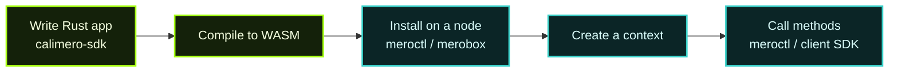

This is the fast path to building a Calimero application. Read it top to bottom, then follow the links to the deep references.

## How a Calimero app works

You build the application logic in **Rust** with the `calimero-sdk`, compile it to **WebAssembly (WASM)**, and install that WASM on a Calimero node. The node runs your logic inside **contexts** — isolated, replicated execution environments whose state syncs automatically across members using CRDTs. Clients (web, scripts, tools) call your app methods over JSON-RPC.

```mermaid
flowchart LR
    WRITE[Write Rust app<br/>calimero-sdk] --> BUILD[Compile to WASM]
    BUILD --> INSTALL[Install on a node<br/>meroctl / merobox]
    INSTALL --> CONTEXT[Create a context]
    CONTEXT --> CALL[Call methods<br/>meroctl / client SDK]

    classDef lime fill:#14210a,stroke:#a5ff11,color:#f5ffe0,stroke-width:2px;
    classDef cyan fill:#0b2526,stroke:#39d0c8,color:#dcfffd,stroke-width:2px;
    class WRITE,BUILD lime;
    class INSTALL,CONTEXT,CALL cyan;
```

## The build path

1. **Write the app** in Rust: define state with `#[app::state]`, methods with `#[app::logic]`, and use CRDT collections for anything that syncs. See [SDK Guide](/builder-directory/sdk-guide/).
2. **Compile to WASM**: `cargo build --target wasm32-unknown-unknown --profile app-release`. The build also emits an ABI manifest (`res/abi.json`).
3. **Install on a node** and note the returned application id: `meroctl app install --path <file.wasm>`.
4. **Create a context** for the app: `meroctl context create --application-id <APP_ID>`.
5. **Call it**: `meroctl call <METHOD> --context <CTX> --args '<JSON>'`, or from a client SDK.

For local multi-node development, [merobox](https://github.com/calimero-network/merobox) spins the whole loop up in Docker and can script it as a YAML workflow.

## Toolchain checklist

| Tool | Role | Install |
| --- | --- | --- |
| `calimero-sdk` (Rust) | App SDK — write your logic | Cargo dependency (in [Core](https://calimero-network.github.io/core/build/)) |
| **merod** | The node runtime that executes apps | See [Core /operate/](https://calimero-network.github.io/core/operate/) |
| **meroctl** | CLI to install apps, manage contexts, call methods | `brew install calimero-network/tap/meroctl` |
| **merobox** | Local multi-node networks + workflows | `pipx install merobox` or `brew install calimero-network/tap/merobox` |
| `calimero-abi-codegen` | Generate a typed TS client from your ABI | See [mero-devtools-js](https://calimero-network.github.io/mero-devtools-js/) |
| **mero.js** | JavaScript/TypeScript client for calling apps | See [mero.js](https://calimero-network.github.io/mero-js/) |

A `create-mero-app` scaffolder is available to generate a starter project (Rust app + frontend + workflows) — see [Developer Tools](/tools-apis/developer-tools/).

## Where to go next

- [Service SDK (Rust)](/builder-directory/sdk-guide/) — the app model: state, logic, CRDTs, events, storage.
- [Client SDKs](/tools-apis/client-sdks/) — call your app from JS, Python, Kotlin, or Swift.
- [Core Apps Examples](/examples/core-apps-examples/) and [Examples](/examples/) — working reference apps to clone and adapt.
- [Developer Tools](/tools-apis/developer-tools/) and [Client SDKs](/tools-apis/client-sdks/) — the surrounding tooling.
- [Core reference site](https://calimero-network.github.io/core/build/) — the authoritative Rust SDK and runtime documentation.
- [Core Concepts](/core-concepts/) and [Privacy, Verifiability & Security](/privacy-verifiability-security/) — the concepts behind contexts, identity, and private data.
