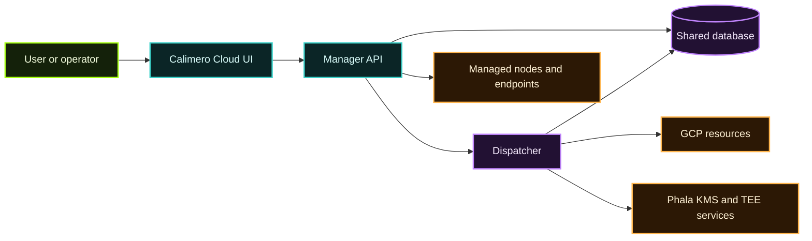

**Calimero Cloud** is the hosted user-facing experience for managing nodes and related infrastructure.  
**MDMA** is the backend system that actually provisions, tracks, and operates that experience.

The two belong together:

- **Cloud** is the product surface.
- **MDMA** is the orchestration and control plane behind it.

## Main components

From the MDMA repository, the system is split into three core services:

| Component | Role |
| --- | --- |
| **Manager** | API and control plane for node lifecycle, users, plans, SSO, and admin flows |
| **Dispatcher** | Background worker that executes provisioning and reconciliation tasks |
| **Cloud** | End-user frontend for sign-in, plans, dashboard, and node UX |

## Mental model

## What MDMA actually handles

The source material describes MDMA as a **node manager** plus hosted platform support. In practice it covers:

- creating and deleting nodes,
- reconciling desired and actual node state,
- managing one-time join keys and invitations,
- coordinating hosted KMS / TEE-related infrastructure,
- exposing cloud-facing user flows,
- enforcing plan and billing behavior,
- routing operator tasks through background execution.

## Why the split exists

The split between Manager and Dispatcher keeps the system sane:

- the **Manager** handles user-facing APIs and desired state,
- the **Dispatcher** performs the slower, environment-touching work,
- the **Cloud frontend** stays focused on user experience rather than infrastructure details.

This is a standard pattern for hosted infrastructure products, and it fits Calimero well because node provisioning and TEE/KMS integration are not instantaneous operations.

## Hosted vs local

| If you want | Best fit |
| --- | --- |
| A local node on your machine | [Calimero Desktop](/tools-apis/desktop/) or local operator docs |
| A scriptable local cluster | [Merobox](/tools-apis/merobox/) |
| Direct node operations | [`meroctl`](/tools-apis/meroctl-cli/) |
| A managed hosted node experience | Calimero Cloud + MDMA |

## Documentation split in this section

- [Cloud Dashboard & Plans](/calimero-cloud/cloud-dashboard/) explains the end-user product view.
- [Operator Architecture](/calimero-cloud/operator-architecture/) explains provisioning, services, and deployment flow.

## Where TEE fits

MDMA also references Phala-backed KMS flows and managed secure infrastructure. For the trust and attestation side of that story, see:

- [mero-tee, KMS & Attestation](/privacy-verifiability-security/mero-tee/)

## Recommended next reads

- [Cloud Dashboard & Plans](/calimero-cloud/cloud-dashboard/)
- [Operator Architecture](/calimero-cloud/operator-architecture/)
- [How Desktop Works](/tools-apis/desktop-internals/)
