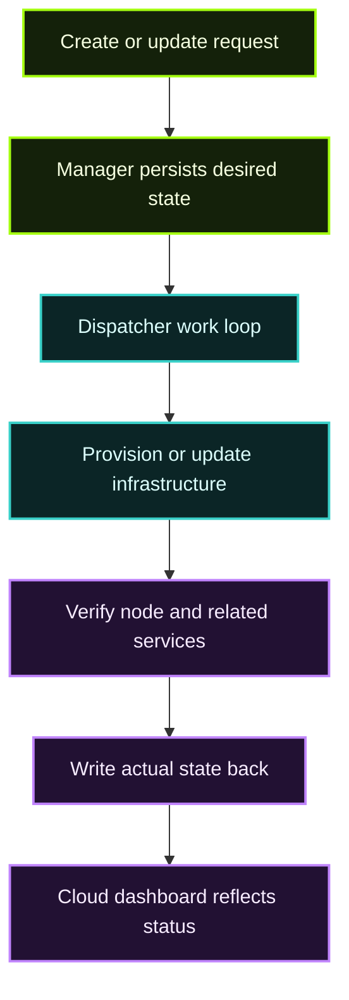

This page is for people running, extending, or integrating the hosted control plane behind Calimero Cloud.

## Service split

The architecture document describes a clean separation:

| Service | Responsibility |
| --- | --- |
| **Manager** | Receives API requests, stores desired state, exposes cloud/user/admin endpoints |
| **Dispatcher** | Executes async provisioning and reconciliation jobs |
| **Database** | Shared state store for user, node, plan, and lifecycle records |
| **GCP integrations** | Infrastructure provisioning and runtime placement |
| **Phala / KMS integrations** | Secure execution and key-management related flows |

## Desired state to actual state

Hosted node management is not just “call create node and done.”  
It is a **desired state system**:

1. a user or API requests a node action,
2. the Manager persists intent,
3. the Dispatcher picks up work,
4. external infrastructure is created or changed,
5. status is written back,
6. the Cloud UI reflects progress and final state.

That pattern is important because provisioning is long-lived and failure-prone compared with a normal request/response API call.

## Node lifecycle view

## Manager responsibilities in more detail

The Manager README makes clear that this service is broader than node CRUD alone. It also handles:

- user and SSO flows,
- Cloud-facing account actions,
- plan and billing-adjacent behavior,
- one-time join keys,
- TEE attestation proxy surfaces,
- admin-facing capabilities.

This makes it the **central product API**, not just an operator-only interface.

## Dispatcher responsibilities

The Dispatcher is where infrastructure-touching logic belongs.

Typical concerns include:

- retry and backoff behavior,
- reconciliation after partial failure,
- idempotent provisioning logic,
- release-pinned execution contracts for KMS-related services,
- keeping stored state aligned with the real environment.

## Kubernetes and deployment notes

The deployment guide shows a GKE-oriented setup with:

- container image build and push,
- DNS delegation,
- ArgoCD sync,
- secret management,
- environment-specific configuration,
- verification and troubleshooting steps.

That means production MDMA is designed like a normal modern control plane:

- GitOps-friendly,
- containerized,
- environment-configured,
- split into API and worker concerns.

## Operational concerns to watch

| Concern | Why it matters |
| --- | --- |
| Shared database consistency | Manager and Dispatcher both rely on lifecycle truth in the DB |
| Infra retries and rollback | Cloud UX depends on clear transitions, not silent drift |
| Secret and key handling | Hosted nodes and KMS flows are security-sensitive |
| Release pinning | Workers must use the expected service versions for secure flows |
| Observability | Long-running async actions need logs and status traceability |

## How this relates to `mero-tee`

The hosted control plane interacts with secure services, but the actual attestation and trust story belongs in the security docs:

- [mero-tee, KMS & Attestation](/privacy-verifiability-security/mero-tee/)

## Recommended next reads

- [Calimero Cloud & MDMA Overview](/calimero-cloud/)
- [Cloud Dashboard & Plans](/calimero-cloud/cloud-dashboard/)
- [Operate Nodes](/operator-track/)
