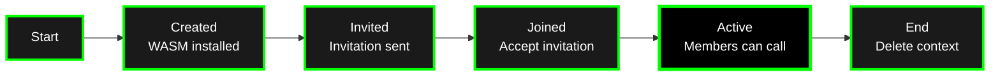
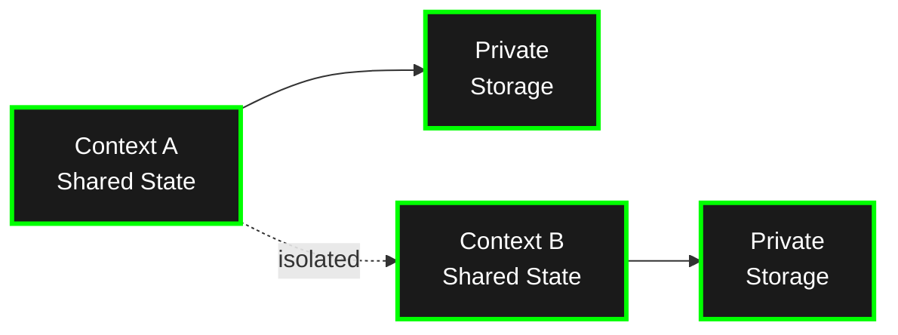

A **context** is an isolated instance of an application running on the Calimero network. Each context has its own state, members, and access controls. Think of it as a "workspace" or "room" where a specific application instance operates.

## What Are Contexts?

Contexts provide:

- **State Isolation**: Each context maintains its own CRDT-backed state, completely separate from other contexts
- **Member Management**: Invite-only access control with cryptographic identities
- **Optional External Anchoring**: A context can optionally anchor a proof or checkpoint to an external ledger for verifiable, tamper-evident state
- **Lifecycle Management**: Create, invite members, join, and manage contexts independently

## Context Lifecycle



### 1. Creation

A context is created when an application is installed and initialized. See [`core/crates/meroctl/README.md`](https://github.com/calimero-network/core/blob/master/crates/meroctl/README.md) for CLI details or visit [getting started](/getting-started/) page.

**What happens:**

- Application WASM is installed on the node
- Initial context state is created (via `#[app::init]` method)
- Context creator becomes the first member
- Context ID is generated (unique identifier)

### 2. Joining a Context (Namespace Model)

Multi-node participation uses **namespaces** — root groups that combine an application with its member network. The `namespace create` command creates both the namespace and its associated context.

```bash
# ── Node 1: Create a namespace with the application ──
$: meroctl --node node1 namespace create --application-id <APP_ID>
> ╭──────────────────────┬──────────────────────────────────────────────╮
> │ Namespace ID         │ FfHXVWRqbSc2wrU2tEeuLQxFcmcpcfZd8Qk9yQFkm7W7 │
> ╰──────────────────────┴──────────────────────────────────────────────╯

# ── Node 1: Generate invitation JSON for another node ──
$: meroctl --node node1 namespace invite FfHXVWRqbSc2wrU2tEeuLQxFcmcpcfZd8Qk9yQFkm7W7
> {
>   "invitation": { ... }
> }

# ── Node 2: Join using the invitation payload ──
$: meroctl --node node2 namespace join FfHXVWRqbSc2wrU2tEeuLQxFcmcpcfZd8Qk9yQFkm7W7 '<INVITATION_JSON>'
> ╭───────────────────────────────╮
> │ Successfully joined namespace │
> ╰───────────────────────────────╯

# ── Node 2: Join a specific context within the namespace ──
$: meroctl --node node2 group join-context <CONTEXT_ID>
```

**What happens after joining:**
- Member is added to namespace membership
- Member receives current state snapshot
- Member can now call methods and receive updates

### 4. Membership & Permissions

Context members have different permission levels:

- **Creator**: Full control, can invite/revoke members
- **Member**: Can call methods, read state, receive events
- **Read-only**: Can query state but cannot mutate

## State Isolation Model



**Key points:**
- **Shared CRDT State**: Replicated across all member nodes, automatically synchronized
- **Private Storage**: Node-local data that never leaves the executing node
- **Complete Isolation**: Context A cannot access Context B's state

See [`core/crates/storage/README.md`](https://github.com/calimero-network/core/blob/master/crates/storage/README.md) for CRDT implementation details.

## Optional External Anchoring

Contexts operate fully peer-to-peer and do not require any external ledger. Where verifiability matters, a context can **optionally anchor a proof or checkpoint to an external ledger** so that participants (or third parties) can independently verify state without trusting a single operator.

Anchoring is opt-in and provides:
- **Identity verification**: Cryptographic proof of ownership via signed operations
- **Verifiable checkpoints**: A tamper-evident commitment to context state at a point in time
- **Independent audit**: External parties can confirm a checkpoint without accessing private context data

## Context Operations

**Query state:**
```bash
$: meroctl --node <NODE_ID> call <QUERY_METHOD_NAME> \
  --context <CONTEXT_ID> \
  --args <ARGS_IN_JSON>
```

**Mutate state:**
```bash
$: meroctl --node <NODE_ID> call <MUTATE_METHOD_NAME> \
  --context <CONTEXT_ID> \
  --args <ARGS_IN_JSON>
```

**Subscribe to events:**
- WebSocket: Connect to `ws://localhost:2528/ws`
- Use `subscribe` method with `context_id` and `event_type`
- See [API Reference](/reference/) for details

See [`core/crates/meroctl/README.md`](https://github.com/calimero-network/core/blob/master/crates/meroctl/README.md) for complete CLI documentation.

## Context Management

**List contexts:**
```bash
$: meroctl --node <NODE_ID> context ls
```

**Manage member capabilities:**
```bash
meroctl --node <NODE_ID> group members set-caps <GROUP_ID> <MEMBER_IDENTITY> <CAPABILITIES>
```

Revoking access removes the member but preserves state history.

## Application Migration

A namespace can be upgraded to a new application version. Core (v0.11+) tracks migration state per-context and provides visibility into the process.

**Key migration concepts:**

- **Context version** — each context records which app version it is running; displayed via `meroctl namespace ls` or the admin API
- **`AppVersionChanged` event** — emitted when a context's application version changes; subscribe via SSE/WebSocket to react to upgrades in real time
- **`authored_remaining` counter** — how many of a member's authored entries have not yet been migrated; drives UX around "safe to disconnect"
- **Migration check** — before committing a migration, core validates that the new WASM can process the existing state
- **Logical abort** — an in-flight migration can be aborted via `meroctl` or the Python client, which rolls back the pending target and cascades to descendants

**Cascade migration** propagates an upgrade through an entire namespace subtree at once. Use `get_cascade_status` to inspect per-descendant progress and `assert_cascade_complete` (in merobox workflows) to block until convergence.

## Best Practices

1. **One Context Per Use Case**: Create separate contexts for different purposes (e.g., one per team, one per project)
2. **Minimize Members**: Only invite necessary members to reduce sync overhead
3. **Use Private Storage**: Store secrets and node-local data in private storage, not CRDT state
4. **Context Naming**: Use descriptive context IDs or metadata for easier management
5. **Monitor Migrations**: Subscribe to `AppVersionChanged` events or poll `get_cascade_status` when running cascade upgrades

## Deep Dives

For detailed context documentation:

- **Context Management**: [`core/crates/context/README.md`](https://github.com/calimero-network/core/blob/master/crates/context/README.md) - Lifecycle and operations
- **Identity & Permissions**: [Identity](/core-concepts/identity/) - Cryptographic identities and access control
- **Merobox Workflows**: [`merobox` README](https://github.com/calimero-network/merobox#readme) - Automated context creation, migration, and cascade management
- **Client SDKs**: [Client SDKs](/tools-apis/client-sdks/) - `get_cascade_status`, `abort_migration`, and metadata record APIs

## Related Topics

- [Applications](/core-concepts/applications/) - What runs inside contexts
- [Identity](/core-concepts/identity/) - Who can access contexts
- [Nodes](/core-concepts/nodes/) - Where contexts run
- [Architecture Overview](/core-concepts/architecture/) - How contexts fit into the system
