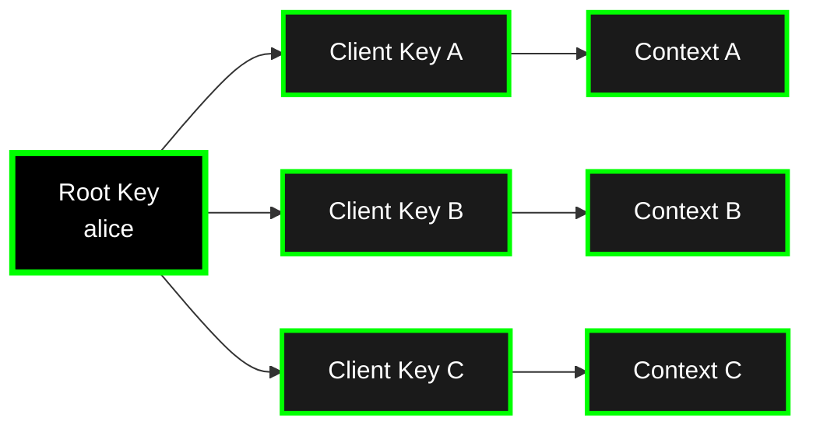

Calimero uses **cryptographic identities** to manage access control and authentication across the network. Each participant has one or more identities that prove ownership and grant permissions.

## Identity Model

Calimero supports a hierarchical identity model:



### Root Keys

A **root key** is an authentication credential that represents a user's master identity in the Calimero auth system. It's typically:

- Generated from a keypair or from a username / password combination
- Used for high-level operations (creating contexts, managing memberships)
- Stored securely (keychain, secure enclave, etc.)

### Client Keys

**Client keys** are derived from root keys and used for:

- Executing methods in specific contexts
- Signing transactions and deltas
- Proving membership in contexts

**Benefits:**

- **Isolation**: Compromise of one client key doesn't affect others
- **Revocation**: Can revoke access per-context without changing root key
- **Privacy**: Different keys for different contexts

## Identity Generation

Generate identities with `meroctl`:

```bash
$: meroctl --node node1 context identity generate
> +-----------------------------------------+---------------------------------------------+
> | Context Identity Generated              | Public Key                                  |
> +=======================================================================================+
> | Successfully generated context identity | 8XG254iKm6YGNJANbkKQpFknmE27TykArAvfJPqHBmw |
> +-----------------------------------------+---------------------------------------------+
```

See [`core/crates/meroctl/README.md`](https://github.com/calimero-network/core/blob/master/crates/meroctl/README.md) for CLI details.

## Hierarchical Keypair Identity

Calimero uses its own hierarchical keypair identity. A root identity delegates per-device client keys, and every operation is signed:

**Flow:**
1. A root identity is created (keypair or username / password)
2. The root delegates a per-device client key
3. Each operation is signed with the client key
4. Calimero verifies the signature and issues a JWT token

See [mero.js](https://calimero-network.github.io/mero-js/) for client authentication examples.

## Authentication Flows

For authentication examples, see:
- **JavaScript**: [mero.js](https://calimero-network.github.io/mero-js/) - Client-side auth flows
- **Python**: [`calimero-client-py/README.md`](https://github.com/calimero-network/calimero-client-py#readme) - Python client auth

## JWT Tokens

After authentication, Calimero issues JWT tokens containing:
- `context_id` - Target context
- `executor_public_key` - Client key for execution
- `permissions` - Access permissions
- `exp` - Expiration timestamp

**Usage:**
- Include in API requests: `Authorization: Bearer <token>`
- Tokens expire and can be refreshed
- See [`core/crates/auth/README.md`](https://github.com/calimero-network/core/blob/master/crates/auth/README.md) for details

## Key Management

**Hierarchical structure:**
- Root keys delegate to client keys per context
- Each context has separate client keys
- Keys can be revoked independently

**Manage member capabilities:**
```bash
$: meroctl --node <NODE_ID> group members set-caps <GROUP_ID> <MEMBER_IDENTITY> <CAPABILITIES>
```

See [`core/crates/meroctl/README.md`](https://github.com/calimero-network/core/blob/master/crates/meroctl/README.md) for key management commands.

**What happens:**
- Key is removed from context membership
- Key can no longer sign transactions for that context
- Existing transactions remain valid (immutable history)
- Root key remains unaffected
- Removed member stops receiving updates

## Client Integration

Calimero clients handle node connection and signed authentication for you:

### JavaScript Client

Use **mero.js** to connect to a node and authenticate. It manages the client key, signs operations, and handles the JWT lifecycle automatically. See the [mero.js documentation](https://calimero-network.github.io/mero-js/) for setup and usage.

### Python Client

```python
from calimero_client_py import create_connection, create_client

# Connect to Calimero network
connection = create_connection(
    api_url="https://node.calimero.network",
    node_name="your-node-name"  # Optional but recommended for token caching
)

# Create a client from the connection
client = create_client(connection)
...
```

## Best Practices

1. **Use Client Keys**: Don't use root keys directly for context operations
2. **Rotate Keys**: Periodically rotate client keys for security
3. **Secure Storage**: Store private keys in secure keychains, never in code
4. **Multi-Signature Approval**: Require multiple signatures for high-value contexts
5. **Key Backup**: Backup root keys securely (secure enclave, offline backup)

## Deep Dives

For detailed identity documentation:

- **Auth Service**: [`core/crates/auth/README.md`](https://github.com/calimero-network/core/blob/master/crates/auth/README.md) - Authentication service
- **Protocol details**: [Core reference site](https://calimero-network.github.io/core/) - Identity, signing, and delegation internals
- **Client SDKs**: [Tools & APIs](/tools-apis/) - Client integration guides

## Related Topics

- [Contexts](/core-concepts/contexts/) - Where identities are used
- [Applications](/core-concepts/applications/) - What identities can access
- [Architecture Overview](/core-concepts/architecture/) - How identity fits into the system
