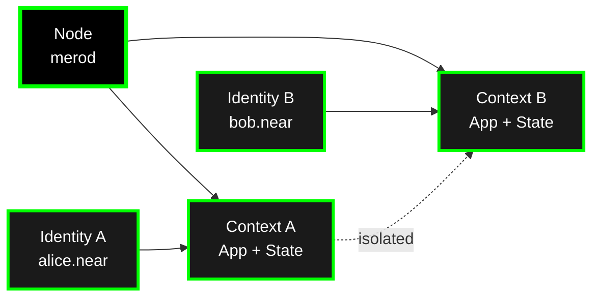

Understanding Calimero's core concepts is essential for building and operating applications. This section covers the fundamental building blocks of the platform.

- **[Contexts](/core-concepts/contexts/)** - Isolated application instances with their own state and members
- **[Identity](/core-concepts/identity/)** - Cryptographic identities for access control and authentication
- **[Applications](/core-concepts/applications/)** - WASM modules that run inside contexts
- **[Nodes](/core-concepts/nodes/)** - Runtime that orchestrates synchronization and execution
- **[Architecture Overview](/core-concepts/architecture/)** - How all components work together

## Contexts

**Contexts** are isolated instances of applications running on the Calimero network. Each context has:

- **Isolated State**: Own CRDT-backed state, completely separate from other contexts
- **Member Management**: Invite-only access control with cryptographic identities
- **Lifecycle**: Create, invite, join, and manage independently

**Key concepts:**
- State isolation model (shared CRDT state vs private storage)
- Invitation and membership flow
- Multi-chain integration (NEAR, Ethereum, ICP, etc.)

[Learn more →](/core-concepts/contexts/)

## Identity

**Identity** in Calimero uses cryptographic keys for access control:

- **Root Keys**: Master identities (from blockchain wallets or username / password combination)
- **Client Keys**: Derived keys for specific contexts
- **Authentication**: Wallet-based authentication (NEAR)

**Key concepts:**

- Hierarchical key management
- Wallet adapters and integration
- JWT tokens for API authentication

[Learn more →](/core-concepts/identity/)

## Applications

**Applications** are WASM modules that run inside contexts:

- **WASM Runtime**: Sandboxed execution environment
- **CRDT State**: Conflict-free data types for automatic synchronization
- **Event System**: Real-time event emission and handling
- **Private Storage**: Node-local data that never leaves the node

**Key concepts:**

- SDK macros (`#[app::state]`, `#[app::logic]`)
- CRDT collections (UnorderedMap, Vector, Counter, etc.)
- Views vs mutations
- ABI generation for client bindings

[Learn more →](/core-concepts/applications/)

## Nodes

**Nodes** (`merod`) orchestrate synchronization and execution:

- **Node Types**: Coordinator (first node) or Peer (joins network)
- **Synchronization**: Dual-path sync (Gossipsub + periodic P2P)
- **Event Handling**: Automatic event handler execution
- **Blob Distribution**: Content-addressed file sharing

**Key concepts:**
- NodeManager architecture
- Delta propagation and application
- Admin surfaces (JSON-RPC, WebSocket, SSE)

[Learn more →](/core-concepts/nodes/)

## Architecture Overview

The **Architecture Overview** explains how all components work together:

- **Four-Layer Architecture**: Application, Node, Storage, Network layers
- **Transaction Flow**: How requests flow through the system
- **Synchronization Flow**: Dual-path sync strategy
- **DAG-Based Ordering**: Causal ordering for out-of-order delivery
- **Component Map**: Detailed breakdown of each crate

[Learn more →](/core-concepts/architecture/)

## How Concepts Relate

## Learning Path

**New to Calimero?** Start here:

1. **[Architecture Overview](/core-concepts/architecture/)** - Understand the big picture
2. **[Applications](/core-concepts/applications/)** - Learn how to build apps
3. **[Contexts](/core-concepts/contexts/)** - Understand application instances
4. **[Identity](/core-concepts/identity/)** - Learn about access control
5. **[Nodes](/core-concepts/nodes/)** - Understand the runtime

**Ready to build?** Check out:

- [Getting Started](/getting-started/) - Step-by-step guides
- [Builder Directory](/builder-directory/) - Development resources
- [Examples](/examples/) - Working applications

**Need to operate?** See:

- [Running Nodes](/operator-track/run-a-local-network/) - Setup and deployment
- [Monitoring](/operator-track/monitor-and-debug/) - Observability
- [API Reference](/reference/) - Complete API documentation

---

**Next**: Start with [Architecture Overview](/core-concepts/architecture/) to understand how everything fits together.
