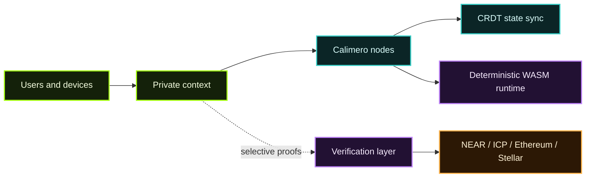

## Why Calimero Exists

The Internet was designed to be **peer-to-peer**. From its origins in **DARPA’s [research](https://en.wikipedia.org/wiki/ARPANET) on packet switching** — a response to the fragility of circuit-switched networks like telephony — the Internet’s architecture has always favored decentralization. Protocols such as **[TCP/IP](https://en.wikipedia.org/wiki/Internet_protocol_suite)** and **[SMTP](https://en.wikipedia.org/wiki/Simple_Mail_Transfer_Protocol)** embody this spirit: open, resilient, and without a central authority. Calimero builds upon that same idea.

- **Calimero is not a [blockchain](https://en.wikipedia.org/wiki/Blockchain).**
- **Calimero is an application layer** built on top of the network — a place for collaboration, computation, and coordination between peers.
- Where a blockchain would rely on **consensus**, Calimero uses **[CRDTs](https://crdt.tech/) (Conflict-free Replicated Data Types)** for distributed consistency without global agreement.

Calimero is the layer you reach for when you *don’t* need the guarantees (or costs) of consensus — when local autonomy and asynchronous coordination are enough.

## Build Self-Sovereign Applications with CRDT-Powered P2P Sync

Calimero is a framework for distributed, peer-to-peer applications with automatic conflict-free data synchronization, user-owned data, and verifiable off-chain computing.

| Attribute | What it means |
| --- | --- |
| Local-first by default | Your data stays on your node; you control replication |
| [DAG-based](https://en.wikipedia.org/wiki/Directed_acyclic_graph) CRDT sync | Conflict resolution without coordination, resilient offline |
| Event-driven architecture | Real-time updates emitted across participating nodes |
| Encrypted P2P channels | End-to-end secure sharing between context members |
| [WASM](https://en.wikipedia.org/wiki/WebAssembly) runtime | Build applications in Rust or TypeScript, ship deterministic WebAssembly |
| Multi-chain integrations | Connect [NEAR](https://www.near.org/), [Internet Computer (ICP)](https://internetcomputer.org/), [Ethereum](https://ethereum.org/), and [Stellar](https://stellar.org/) for attestations |

Calimero is a privacy-focused application layer for peer-to-peer collaboration. This site stays concise on purpose: each section orients you in a few minutes, then links directly to the canonical GitHub READMEs for full architecture and workflows.

## Quick Actions

| Start here | What you get |
| --- | --- |
| [Download Desktop](https://calimero.network/download) | GUI app — manage nodes, launch apps, and sign in automatically. No CLI needed. |
| [Launch a local network](/builder-directory/#minimal-dev-loop) | Bootstrap `merod` + Merobox and observe a context end-to-end. |
| [Build from a template](/builder-directory/#choose-your-starting-point) | Scaffold a Rust or TypeScript + React app with `create-mero-app`. |
| [Explore a reference app](/app-directory/#featured-apps) | Learn from maintained examples such as Battleships or Mero Chat. |
| [Understand the architecture](/intro/#core-architecture-snapshot) | See how contexts, nodes, state sync, and identity fit together. |

## Choose Your Path

| If you are… | Go to… | Why |
| --- | --- | --- |
| New to Calimero | [Introduction](/intro/) | Philosophy, architecture snapshot, and repo map. |
| Want a GUI, no CLI | [Calimero Desktop](/tools-apis/desktop/) | Download, install, and manage everything visually. |
| Shipping an application | [Builder Directory](/builder-directory/) | Toolchain checklist, dev loop, and SDK links. |
| Publishing an app to the registry | [App Directory](/app-directory/#publishing-an-app) | Sign, bundle, and push with `mero-sign` + `calimero-registry`. |
| Evaluating existing apps | [App Directory](/app-directory/#featured-apps) | Maintained demos with direct README links. |
| Securing deployments | [Privacy · Verifiability · Security](/privacy-verifiability-security/) | Isolation model, identity delegation, auditability patterns. |
| Looking for tooling | [Tools & APIs](/tools-apis/) | Runtime, admin, SDK, Desktop, signing, and automation catalog. |

## Highlights

- **Contexts as private networks** — CRDT-backed state and scoped storage so teams can collaborate without global consensus.
- **Hierarchical identities** — Root keys delegate client keys per device, integrating with NEAR wallets.
- **Modular runtime** — `merod` orchestrates networking ([libp2p](https://libp2p.io/)), storage, and WASM apps with JSON-RPC/WebSocket surfaces.
- **Repository-first docs** — Detailed flows live in project READMEs such as [`calimero-network/core`](https://github.com/calimero-network/core#readme) and [`calimero-network/merobox`](https://github.com/calimero-network/merobox#readme).
