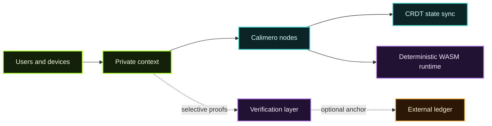

## The Internet was meant to be peer-to-peer

Packet switching was invented to route around failure — no center to knock out, no single authority to ask permission. The protocols that won, **[TCP/IP](https://en.wikipedia.org/wiki/Internet_protocol_suite)**, **[SMTP](https://en.wikipedia.org/wiki/Simple_Mail_Transfer_Protocol)**, and the early Web, were open and federated. Your machine was a **peer**, not a client asking a server for permission to see its own data.

## Why we centralized — and why that's reversing

Decentralization was always the design; for thirty years it was simply the *harder* path, and the cloud won on convenience. But every force that pushed us into the datacenter has since flipped:

| Force | Why we centralized | Why peer-to-peer works now |
| --- | --- | --- |
| **Hardware** | Home machines were weak, slept, sat behind NAT, and changed IP addresses — unreliable hosts. | Phones and laptops have many cores, gigabytes of RAM, and always-on connectivity. |
| **Bandwidth** | Links were scarce and metered; keeping data near users wasn't practical. | Ubiquitous broadband and 5G make always-on peers realistic. |
| **Cost at scale** | "Decentralized" was assumed to mean "more expensive" — the naive model replicates all data to every node. | State is *sharded by context* — each node stores and syncs only the contexts it belongs to, so cost scales with what you actually use, not the size of the network. |
| **Developer experience** | Conflict resolution, sync, key management, NAT traversal — each was a dissertation, not a library. | Composable primitives: [WASM](https://en.wikipedia.org/wiki/WebAssembly) runtimes, [libp2p](https://libp2p.io/), mature [CRDT](https://crdt.tech/) libraries, Rust. |
| **User experience** | One server was easier to ship and reason about than coordinating thousands. | Local-first apps feel instant, work offline, and sync the moment they reconnect. |
| **Security** | Trusting a single server you ran was the only practical model. | End-to-end encryption by default, and Trusted Execution Environments whose attestation makes even *hosted* infrastructure verifiable. |
| **Open source** | The stack was proprietary, or a from-scratch build behind a vendor's walls. | A deep open-source foundation — Rust, WASM, libp2p, CRDTs — and fully open platforms like Calimero you can run, read, fork, and extend. |

So we traded ownership for convenience — our data moved onto other people's servers, and we now rent access to it, along with the outages, lock-in, surveillance, and breaches that come with a single point of control. That trade no longer holds: you can finally have decentralization's **ownership and privacy** *together with* the cloud's **convenience**. Closing that gap is what Calimero is for.

[Why Calimero →](/vision/why-calimero/) · [How it compares to Holepunch, Nostr, and others →](/vision/comparison/)

## What Calimero is

Calimero is a **privacy-first application layer** for peer-to-peer collaboration — **not a [blockchain](https://en.wikipedia.org/wiki/Blockchain)**. Where a blockchain reaches global agreement through **consensus** (and pays for it in cost, throughput, and publicity), Calimero uses **[CRDTs](https://crdt.tech/)** so state converges automatically among a group — no quorum, no fees, and even while offline. You write your app once, compile it to WebAssembly, and every node runs the same logic over state that syncs itself. Your data lives with the people using the app; operators never see it.

```mermaid
flowchart LR
    U[Users and devices] --> C[Private context]
    C --> N[Calimero nodes]
    N --> S[CRDT state sync]
    N --> R[Deterministic WASM runtime]
    C -. selective proofs .-> V[Verification layer]
    V -. optional anchor .-> B[External ledger]

    classDef lime fill:#14210a,stroke:#a5ff11,color:#f5ffe0,stroke-width:2px;
    classDef teal fill:#0b2526,stroke:#39d0c8,color:#dcfffd,stroke-width:2px;
    classDef purple fill:#221133,stroke:#c084fc,color:#f7ecff,stroke-width:2px;
    classDef orange fill:#2c1805,stroke:#ffb54d,color:#fff2d6,stroke-width:2px;

    class U,C lime;
    class N,S teal;
    class R,V purple;
    class B orange;
```

| Attribute | What it means |
| --- | --- |
| Local-first by default | Your data stays on your node; you control replication |
| [DAG-based](https://en.wikipedia.org/wiki/Directed_acyclic_graph) CRDT sync | Conflict resolution without coordination, resilient offline |
| Event-driven architecture | Real-time updates emitted across participating nodes |
| Encrypted P2P channels | End-to-end secure sharing between context members |
| [WASM](https://en.wikipedia.org/wiki/WebAssembly) runtime | Write application logic in Rust, ship deterministic WebAssembly |
| Optional external anchoring | Anchor a proof or checkpoint to an external ledger when you need tamper-evident verification |

## Why build on Calimero

- **Write apps, not infrastructure.** The sandboxed runtime handles the hard, error-prone parts — storage, end-to-end encryption, and conflict-free synchronization — so you write plain application logic and ship. No database to run, no sync code to maintain, no key management to get wrong.
- **Fully open source, no lock-in.** Every layer is open: read it, run it, fork it, customize it. Your app and your users' data belong to you, not to a platform you can't leave.
- **A fair deal, not surveillance.** Most software today monetizes the people using it. Calimero removes the temptation — operators, hosted ones included, can't see user data. Ship your product on [Calimero Cloud](/calimero-cloud/) at a fair, predictable price, or [self-host](/operator-track/) it entirely. It's a win-win: you deliver the best possible service, users keep ownership, and you can move between hosted and self-hosted without rewriting a thing.

## Quick Actions

| Start here | What you get |
| --- | --- |
| [Download Desktop](https://calimero.network/download) | GUI app — manage nodes, launch apps, and sign in automatically. No CLI needed. |
| [Run a local network](/getting-started/) | Bootstrap a node with Merobox and drive a context end-to-end. |
| [Build from a template](/builder-directory/) | Scaffold a Rust app + client with `create-mero-app`. |
| [Explore a reference app](/app-directory/) | Learn from maintained examples such as Battleships or Mero Chat. |
| [Understand the architecture](/vision/architecture/) | See how contexts, nodes, state sync, and identity fit together. |

## Choose Your Path

| If you are… | Go to… | Why |
| --- | --- | --- |
| New to Calimero | [Introduction](/intro/) | Philosophy, architecture snapshot, and a first run. |
| Curious about the vision | [Why Calimero](/vision/why-calimero/) | The full case, the ecosystem, and how it compares. |
| Want a GUI, no CLI | [Calimero Desktop](/tools-apis/desktop/) | Download, install, and manage everything visually. |
| Shipping an application | [Builder Directory](/builder-directory/) | Toolchain checklist, dev loop, and SDK links. |
| Publishing an app to the registry | [App Directory](/app-directory/) | Sign, bundle, and push with `mero-sign` + `calimero-registry`. |
| Securing deployments | [Privacy · Verifiability · Security](/privacy-verifiability-security/) | Isolation model, identity delegation, auditability patterns. |
| Looking for tooling | [Tools & APIs](/tools-apis/) | Runtime, admin, SDK, Desktop, signing, and automation catalog. |

## Highlights

- **Contexts as private networks** — CRDT-backed state and scoped storage so teams can collaborate without global consensus.
- **Hierarchical identities** — A root identity delegates per-device client keys; every operation is signed.
- **Modular runtime** — `merod` orchestrates networking ([libp2p](https://libp2p.io/)), storage, and WASM apps with JSON-RPC / WebSocket surfaces.
- **Reference-site docs** — This site stays high-level; the full detail lives in the per-tool reference sites for [core](https://calimero-network.github.io/core/), [mero.js](https://calimero-network.github.io/mero-js/), and the rest of the stack.
