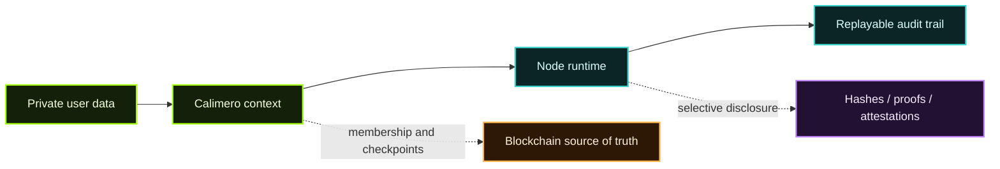

Calimero integrates with blockchain infrastructure — not to perform computation, but to provide a **source of truth** for:

- Network membership (list of participants)
- Roles and permissions
- Verifiable state checkpoints

In this modular stack:

- Calimero handles **data collaboration and replication**.
- The blockchain layer provides **immutability and verification**.
- Other tools like **zero-knowledge proofs (ZK)** can extend privacy guarantees.

Calimero is a component of a broader **privacy-oriented architecture** — modular, composable, and adaptable to your needs.

## Trust Boundaries

## Isolation Model at a Glance

- **Contexts scope visibility** — each context has shared CRDT state plus per-member private storage (`#[app::private]`).
- **Hierarchical identities** — root keys issue client keys per device or integration; revocation cascades from the root.
- **Deterministic runtime** — WASM apps run inside `merod`, so every state transition is deterministic and replayable.
- **Selective disclosure** — events can reveal only hashed or redacted payloads while full data stays on the owner’s node.
- **Audit trail** — every method call is tied to the caller via `executor_id`, enabling tamper-evident logs.

## Verification Pathways

| Layer | What is verified | How |
| --- | --- | --- |
| Context membership | Who can read/write state | Anchored invites or role assignments persisted on-chain |
| State synchronization | CRDT merges, Merkle checkpoints | Nodes exchange proofs before accepting remote updates |
| Application integrity | WASM binaries, configuration | Hashes committed to L1, compared during deployment |
| User actions | Caller identity, authorization | Challenge/response over wallet connector + executor audit logs |
| Data access | Private vs shared storage | Storage namespaces tied to caller identity, enforced in runtime |

## Hardening Checklist

1. Anchor critical context membership changes to NEAR.
2. Enable event payload hashing when emitting sensitive data; share full payloads via authenticated channels only.
3. Rotate client keys on a cadence and revoke stale devices at the root key level.
4. Run periodic Merkle checkpoint comparisons across nodes to detect divergence early.
5. Configure node monitoring (Admin Dashboard, Node Console) to alert on failed syncs or unauthorized method calls.

## Where to Deep Dive

| Topic | Reference | Why it matters |
| --- | --- | --- |
| Hosted TEE, KMS, and attestation | [mero-tee, KMS & Attestation](/privacy-verifiability-security/mero-tee/) | Explains secure-service execution, attestation evidence, and how hosted trust claims are verified |
| Runtime architecture & security model | [`calimero-network/core` – Architecture](https://github.com/calimero-network/core#architecture) | Details on `merod`, networking layers, and verification primitives |
| Identity delegation & permissions | [`calimero-network/contracts`](https://github.com/calimero-network/contracts) | How root/client keys, invites, and revocations are enforced |
| Context lifecycle & admin API | [`calimero-network/merobox` – Workflows](https://github.com/calimero-network/merobox#workflows) | Managing contexts, capturing Application IDs, production rollouts |
| Authentication adapters & wallet flows | [`calimero-network/core`](https://github.com/calimero-network/core) | Challenge/response flows for NEAR |
| Advanced cryptography experiments | [`calimero-network/experiments`](https://github.com/calimero-network/experiments) | Threshold signing, multi-party custody, and ZK experiments |

_This page stays high-level. For full setup steps, audit procedures, and API details, follow the linked READMEs._
