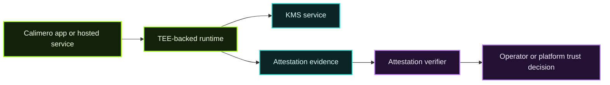

`mero-tee` is the part of the Calimero ecosystem focused on **trusted execution**, **key-management support**, and **attestation verification**.

It does not replace Calimero’s general privacy model. Instead, it strengthens the path where an operator or hosted platform needs stronger proof about **where sensitive logic ran** and **which environment was trusted**.

## What lives in `mero-tee`

From the repository README, the project includes:

| Component | Purpose |
| --- | --- |
| `mero-kms-phala` | KMS-related service designed to run with Phala-backed secure execution |
| `node-image-gcp` | Build assets for GCP-hosted node images |
| `attestation-verifier` | Logic for verifying attestation evidence |

## Why it exists

Calimero already aims for privacy-preserving, isolated application execution.  
`mero-tee` adds stronger guarantees for cases where you also want:

- hardware-backed or TEE-backed execution assurances,
- controlled key material handling,
- evidence that a particular secure environment was the one that ran a service,
- hosted secure infrastructure that can be checked rather than merely trusted by policy.

## Trust model in one picture

## How this connects to the wider Calimero docs

### Privacy

Calimero’s broader privacy story already covers:

- isolated execution,
- verifiable context behavior,
- minimal trust between application participants.

### `mero-tee`

`mero-tee` adds a more infrastructure-centric layer:

- secure runtime claims,
- secure key custody flows,
- attestation as evidence,
- hosted-service hardening for sensitive operations.

## Practical interpretation

If you are a builder, you usually do **not** need to understand every internal detail of `mero-tee` before shipping an app.

If you are operating hosted or managed secure services, you likely do need to understand:

- what is being attested,
- where attestation evidence is verified,
- what the verifier is allowed to trust,
- which release artifacts are expected for a secure deployment.

## Release and verification

The repo explicitly points users to **release verification** guidance and an external architecture reference. That is a strong signal that secure deployment here is expected to be:

- version-aware,
- artifact-aware,
- checked against published release material,
- not treated as an opaque black box.

## Relationship to Cloud / MDMA

The MDMA architecture references Phala and KMS-backed flows as part of the hosted control plane story. That means:

- Cloud and MDMA orchestrate the platform,
- `mero-tee` contributes the secure execution and attestation pieces,
- the verifier helps bridge “secure service claims” into something an operator can reason about.

## When to care deeply about this page

You should go deeper into `mero-tee` when you are:

- deploying hosted secure services,
- reasoning about key custody in managed infrastructure,
- validating attestation evidence,
- hardening a regulated or high-trust deployment.

If you are not doing those things, it is enough to know that this layer strengthens the platform’s verifiability story for sensitive infrastructure paths.

## Recommended next reads

- [Privacy, Verifiability & Security](/privacy-verifiability-security/)
- [Calimero Cloud & MDMA](/calimero-cloud/)
- [Operator Architecture](/calimero-cloud/operator-architecture/)
