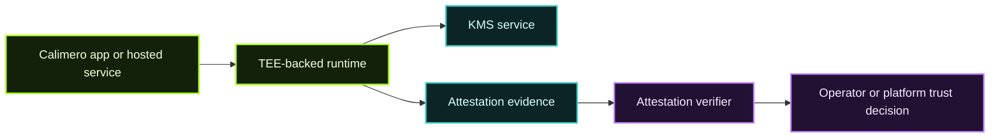

`mero-tee` is the part of the Calimero ecosystem focused on **trusted execution**, **key-management support**, and **attestation verification**.

It does not replace Calimero’s general privacy model. Instead, it strengthens the path where an operator or hosted platform needs stronger proof about **where sensitive logic ran** and **which environment was trusted**.

## What lives in `mero-tee`

| Component | Purpose |
| --- | --- |
| `mero-kms-phala` | KMS service that validates TDX attestations and releases storage encryption keys to `merod` nodes running in Phala CVMs |
| `mero-tee/` | GCP Packer build pipeline for locked `merod` node images with TDX attestation (debug, debug-read-only, locked-read-only profiles) |
| `fleet-sidecar` | systemd service baked into read-only fleet node images; waits for `merod` readiness, reads its own peer ID and MRTD, polls MDMA for group assignments, and joins each via `meroctl tee fleet-join` — confirms back to MDMA only when the join exits 0 |
| `attestation-verifier/` | Public web tool for verifying KMS and node attestations via Intel Trust Authority |

The fleet sidecar (image v2.3.45 / merod v0.10.1-rc.44) now sends the node's MRTD alongside its peer ID in the `should-join` poll, enabling MDMA to enforce MRTD-gated admission. Join confirmations are retried until confirmed.

## Why it exists

Calimero already aims for privacy-preserving, isolated application execution.  
`mero-tee` adds stronger guarantees for cases where you also want:

- hardware-backed or TEE-backed execution assurances,
- controlled key material handling,
- evidence that a particular secure environment was the one that ran a service,
- hosted secure infrastructure that can be checked rather than merely trusted by policy.

## Trust model in one picture


```mermaid
flowchart LR
    APP[Calimero app or hosted service] --> TEE[TEE-backed runtime]
    TEE --> KMS[KMS service]
    TEE --> EVIDENCE[Attestation evidence]
    EVIDENCE --> VERIFY[Attestation verifier]
    VERIFY --> POLICY[Operator or platform trust decision]

    classDef lime fill:#14210a,stroke:#a5ff11,color:#f5ffe0,stroke-width:2px;
    classDef cyan fill:#0b2526,stroke:#39d0c8,color:#dcfffd,stroke-width:2px;
    classDef purple fill:#221133,stroke:#c084fc,color:#f7ecff,stroke-width:2px;

    class APP,TEE lime;
    class KMS,EVIDENCE cyan;
    class VERIFY,POLICY purple;
```

## How this connects to the wider Calimero docs

### Privacy

Calimero’s broader privacy story already covers:

- isolated execution,
- verifiable context behavior,
- minimal trust between application participants.

### `mero-tee`

`mero-tee` adds a more infrastructure-centric layer:

- secure runtime claims,
- secure key custody flows,
- attestation as evidence,
- hosted-service hardening for sensitive operations.

## Practical interpretation

If you are a builder, you usually do **not** need to understand every internal detail of `mero-tee` before shipping an app.

If you are operating hosted or managed secure services, you likely do need to understand:

- what is being attested,
- where attestation evidence is verified,
- what the verifier is allowed to trust,
- which release artifacts are expected for a secure deployment.

## Release and verification

Two artifact families are published per version:

- **`mero-kms-vX.Y.Z`** — KMS binaries, attestation policies, compatibility map, Sigstore signatures
- **`mero-tee-vX.Y.Z`** — `published-mrtds.json`, release provenance, SBOM, checksums, Sigstore signatures

Verify release assets:

```bash
scripts/release/verify-release-assets.sh X.Y.Z
```

Generate a pinned `merod` KMS config from a signed release policy:

```bash
scripts/policy/generate-merod-kms-phala-attestation-config.sh \
  --profile locked-read-only X.Y.Z https://<kms-url>/
```

That is a strong signal that secure deployment here is expected to be:

- version-aware,
- artifact-aware,
- checked against published release material,
- not treated as an opaque black box.

## Relationship to Cloud / MDMA

The MDMA architecture references Phala and KMS-backed flows as part of the hosted control plane story. That means:

- Cloud and MDMA orchestrate the platform,
- `mero-tee` contributes the secure execution and attestation pieces,
- the verifier helps bridge “secure service claims” into something an operator can reason about.

## When to care deeply about this page

You should go deeper into `mero-tee` when you are:

- deploying hosted secure services,
- reasoning about key custody in managed infrastructure,
- validating attestation evidence,
- hardening a regulated or high-trust deployment.

If you are not doing those things, it is enough to know that this layer strengthens the platform’s verifiability story for sensitive infrastructure paths.

## Recommended next reads

- [Privacy, Verifiability & Security](/privacy-verifiability-security/)
- [Calimero Cloud & MDMA](/calimero-cloud/)
- [Operator Architecture](/calimero-cloud/operator-architecture/)
