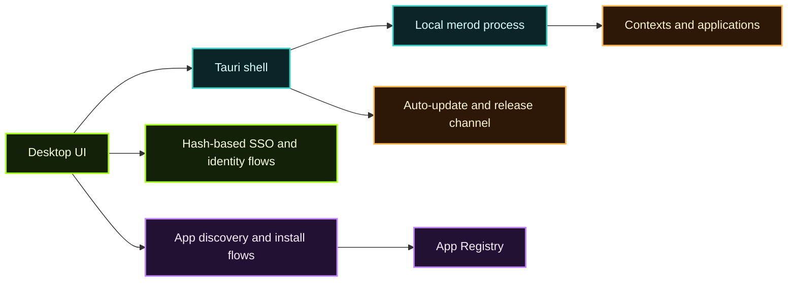

[Calimero Desktop](/tools-apis/desktop/) is the end-user application. This page explains the architecture behind it and how it fits into the wider Calimero stack.

## High-level architecture

Calimero Desktop is built as a **Tauri application** with a web frontend and native integrations for node lifecycle management.



## Main responsibilities

### 1. Local node management

Desktop provides a user-facing control plane for the local node.

That includes:

- starting and stopping the bundled or installed `merod`,
- wiring user actions to node APIs,
- exposing a simpler install and launch experience than raw CLI usage,
- surfacing context and application state without forcing users into terminal workflows.

### 2. Identity and sign-in flow

The existing desktop docs mention **SSO for developers**. In practice, the app coordinates browser-based auth with a return-to-desktop flow using a hash/redirect exchange.

This is useful when:

- a user signs into a Calimero-hosted experience,
- a builder wants a smooth “open in desktop” experience,
- the desktop app needs to recover the auth result after the browser hands control back.

### 3. App installation UX

Desktop is one of the main consumers of the [App Registry](/app-directory/registry-overview/).

Typical flow:

1. browse or receive an app reference,
2. resolve the bundle,
3. verify the artifact/signature path,
4. install the app into a local node,
5. create or join a context,
6. launch the application UI and methods from the desktop shell.

## Monorepo pieces

The `tauri-app` repository includes more than just the desktop binary:

| Part | Role |
| --- | --- |
| `apps/desktop` | Main desktop application |
| `apps/download-site` | Distribution/download website |
| `packages/*` | Shared React/JS packages used by the app and related tooling |

This separation matters because the desktop user experience, update pipeline, and reusable UI packages evolve together.

## Development workflow

The Tauri app monorepo supports a normal web-like dev loop plus native packaging:

```bash
pnpm install
pnpm --filter desktop dev
```

Important prerequisites from the source repo:

- Node.js
- `pnpm`
- Rust toolchain
- platform-specific Tauri dependencies

There is also explicit support for **opening DevTools** during development with the shortcut:

```text
Cmd/Ctrl + Shift + I
```

## Update and release model

The Tauri monorepo also documents auto-updates and release handling. That makes Desktop more than a wrapper around a node binary. It is a **maintained delivery surface** with:

- packaged builds,
- update channels,
- release automation,
- a companion download site.

## When to use Desktop vs CLI

| Use Desktop when | Use CLI when |
| --- | --- |
| You want a graphical install and launch flow | You need scripts, CI, or automation |
| You are onboarding new users or testers | You are managing nodes headlessly |
| You need SSO/browser-assisted desktop UX | You want reproducible terminal operations |
| You want app browsing and installability in one place | You are debugging low-level runtime issues |

Desktop and CLI are complementary, not competing surfaces.

## How it fits with the rest of Calimero

- Desktop gives users a **local-first control surface**.
- `merod` provides the node runtime.
- The App Registry provides signed app discovery and distribution.
- Cloud/MDMA provides hosted operator and managed-node workflows.

## Recommended next reads

- [Desktop](/tools-apis/desktop/)
- [App Registry](/app-directory/registry-overview/)
- [Calimero Cloud & MDMA](/calimero-cloud/)
