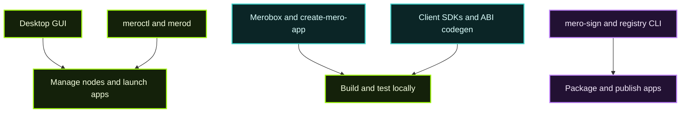

> **Info**
> Every entry below links to its canonical README. Follow those for installation flags, API surfaces, and deeper guides.
>
Use this directory as a jumping-off point; it shows you **what exists** and **where to learn more** without duplicating repo docs.

## Tool Map

## Which tool do I need?

| Goal | Tool |
| --- | --- |
| GUI: manage nodes, launch apps, SSO | [Calimero Desktop](/tools-apis/desktop/) |
| CLI: manage a live node | [`meroctl`](/tools-apis/meroctl-cli/) |
| Local dev / multi-node testing | [Merobox](/tools-apis/merobox/) |
| Sign an app bundle | [`mero-sign`](/tools-apis/mero-sign/) |
| Bundle and publish apps to the registry | [`calimero-registry`](#publishing) |
| Generate TypeScript clients from Rust ABIs | [ABI Codegen](/tools-apis/developer-tools/) |
| Managed hosted nodes | [Calimero Cloud & MDMA](/calimero-cloud/) |

---

## Desktop

| Tool | Reference | Notes |
| --- | --- | --- |
| Calimero Desktop | [Desktop Guide](/tools-apis/desktop/) · [Download](https://calimero.network/download) | GUI for node management, identity, context browsing, and launching apps with built-in SSO. |
| Desktop Architecture | [How Desktop Works](/tools-apis/desktop-internals/) | Tauri shell, local node orchestration, install flow, SSO return path, and release/update model. |

## Runtime & Admin

| Tool | Reference | Notes |
| --- | --- | --- |
| `merod` | [`calimero-network/core`](https://github.com/calimero-network/core#readme) | Node runtime orchestrating WASM apps, storage, networking, RPC. |
| `meroctl` | [CLI Reference](/tools-apis/meroctl-cli/) | Command-line surface for context lifecycle, deployment, diagnostics. See also [`core/crates/meroctl`](https://github.com/calimero-network/core/tree/master/crates/meroctl) for source code. |
| Admin Dashboard | [`calimero-network/admin-dashboard`](https://github.com/calimero-network/admin-dashboard#readme) | Web UI for member management, metrics, alerts. |

## Developer Tooling

> **Tip: Developer Tools Guide**
> For comprehensive documentation on Merobox, ABI Codegen, and create-mero-app, see the [Developer Tools Guide](/tools-apis/developer-tools/).
>
| Tool | Reference | Notes |
| --- | --- | --- |
| Developer Tools | [Developer Tools Guide](/tools-apis/developer-tools/) | Comprehensive guide to Merobox (local networks), ABI Codegen (TypeScript generation), and create-mero-app (boilerplate scaffolding). |
| Merobox | [Merobox Guide](/tools-apis/merobox/) · [`calimero-network/merobox`](https://github.com/calimero-network/merobox#readme) | Docker/native node management, workflow YAML orchestration, remote-node control, and local test harnesses. |
| ABI Codegen | [`calimero-network/mero-devtools-js`](https://github.com/calimero-network/mero-devtools-js#readme) | Generate TypeScript clients from Rust application ABIs. |
| create-mero-app | [`calimero-network/mero-devtools-js`](https://github.com/calimero-network/mero-devtools-js#readme) | Scaffold new Calimero apps from kv-store boilerplate. |
| Design System | [`calimero-network/design-system`](https://github.com/calimero-network/design-system#readme) | Shared UI components and tokens. |

## Managed Cloud

| Tool | Reference | Notes |
| --- | --- | --- |
| Calimero Cloud | [Cloud & MDMA Overview](/calimero-cloud/) | Hosted dashboard and account surface for managed Calimero nodes. |
| MDMA control plane | [Operator Architecture](/calimero-cloud/operator-architecture/) | Manager + Dispatcher + infrastructure orchestration behind the hosted platform. |

## SDKs & Clients

> **Tip: Client SDKs Guide**
> For comprehensive documentation on all three client SDKs (Rust, Python, JavaScript), see the [Client SDKs Guide](/tools-apis/client-sdks/).
>
| SDK | Reference | Notes |
| --- | --- | --- |
| Client SDKs | [Client SDKs Guide](/tools-apis/client-sdks/) | Comprehensive guide to Rust, Python, and JavaScript client SDKs for interacting with Calimero nodes. |
| JavaScript Client | [`calimero-network/calimero-client-js`](https://github.com/calimero-network/calimero-client-js#readme) | Browser/Node bindings, event streaming, auth helpers. ✅ Full authentication support. |
| Python Client | [`calimero-network/calimero-client-py`](https://github.com/calimero-network/calimero-client-py#readme) | Python bindings, ABI tooling, automation recipes. ⚠️ Authentication support planned. |
| Rust Client | [`calimero-network/core/crates/client`](https://github.com/calimero-network/core/tree/master/crates/client) | Rust client SDK for CLI tools and sidecar services. ⚠️ Authentication support planned. |
| Rust SDK | [`calimero-network/core/crates/sdk`](https://github.com/calimero-network/core/tree/master/crates/sdk) | App macros, storage primitives, state helpers. For building Calimero applications. |

## Publishing

| Tool | Reference | Notes |
| --- | --- | --- |
| `mero-sign` | [mero-sign Guide](/tools-apis/mero-sign/) · [`core/tools/mero-sign`](https://github.com/calimero-network/core/tree/master/tools/mero-sign) | Ed25519 key management and manifest signing. Required before publishing any bundle. Install: `cargo install mero-sign` |
| `calimero-registry` | [`calimero-network/app-registry`](https://github.com/calimero-network/app-registry) | CLI for bundling and pushing apps to the Calimero App Registry. See [Publishing Apps](/app-directory/#publishing-an-app). |

## Automation & Workflows

| Resource | Reference | Notes |
| --- | --- | --- |
| Merobox Workflows | [`battleships` example repo](https://github.com/calimero-network/battleships) | Reusable network topologies for local + CI. |
| Docs & CI scripts | [`calimero-network/docs`](https://github.com/calimero-network/docs#readme) | MkDocs site, link policies, CI glue. |

> **Tip**
> Pick a tool, follow its README end-to-end, then link back into MKDocs when you need a refresher. These pages stay minimal by design.
>
>
>
>
