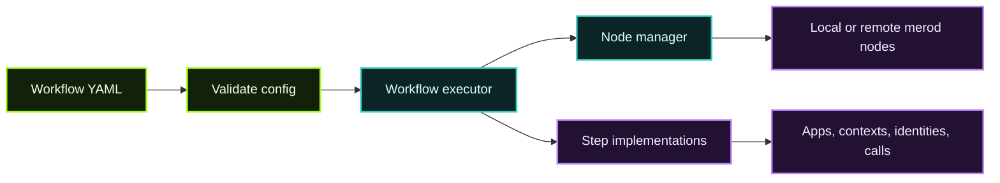

**Merobox** is a Python CLI for managing Calimero nodes and orchestrating multi-step workflows from YAML.

It is especially useful when you want to stand up a reproducible environment quickly without manually stitching together node lifecycle, auth, and application calls.

## What Merobox is best at

| Use case | Why Merobox fits |
| --- | --- |
| Local multi-node testing | Start multiple nodes together and inspect health |
| Workflow automation | Encode install, context, join, and call flows as YAML |
| Reproducible demos | Keep bootstrap steps versioned in one file |
| Integration testing | Reuse workflows in CI or pytest harnesses |
| Remote-node orchestration | Drive already running nodes through one tool |

## Typical commands

```bash
# Start two local nodes
merobox run --count 2

# Check status
merobox health

# Execute a YAML workflow
merobox bootstrap run workflow.yml

# Stop the cluster
merobox stop --all
```

## Workflow model

Merobox includes a workflow engine with validation and many built-in step types.

Examples include:

- `install_application`
- `create_context`
- `create_identity`
- `join_context`
- `call`
- `parallel`
- `repeat`
- `wait`
- `wait_for_sync`
- `script`

That makes it a strong bridge between **one-off scripts** and a **full test harness**.

## Why builders use it

The biggest benefit of Merobox is that a workflow can capture a complete setup:

1. start nodes,
2. install an app,
3. create a context,
4. invite or join participants,
5. call methods,
6. assert that sync or state propagation happened.

In other words, it is a **scenario runner** for Calimero systems.

## Example mental model



## Local and remote operation

From the source repo:

- you can run nodes in **Docker** mode,
- or manage **native binary** mode,
- and connect to **remote nodes** with credentials or API keys.

That flexibility makes Merobox useful both for local experiments and for more advanced staging or support workflows.

## Near sandbox integration

Merobox also documents local NEAR Sandbox support, which is useful when your testing flow needs blockchain-connected paths without paying real network costs.

This is a strong fit for:

- app development,
- local demonstrations,
- end-to-end tests,
- repeatable workshop or tutorial environments.

## Merobox vs other tools

| Tool | Best for |
| --- | --- |
| `meroctl` | Day-to-day direct interaction with a node |
| Merobox | Multi-step orchestration and environment setup |
| Desktop | End-user install, launch, and local UX |
| MDMA / Cloud | Managed nodes and hosted operator workflows |

## When to reach for it

Use Merobox when you catch yourself writing shell scripts like:

- “start 3 nodes”
- “install this app on node 1”
- “create a context”
- “join node 2”
- “call a method 10 times”
- “wait for everyone to sync”

Merobox turns that into a versioned workflow instead of an ad hoc notebook of commands.

## Learn more

The repository links to a full external architecture reference covering:

- workflow engine internals,
- node management,
- remote nodes,
- NEAR integration,
- CLI reference,
- testing and troubleshooting.

## Recommended next reads

- [CLI (meroctl)](/tools-apis/meroctl-cli/)
- [Developer Tools](/tools-apis/developer-tools/)
- [Operator Track](/operator-track/)
