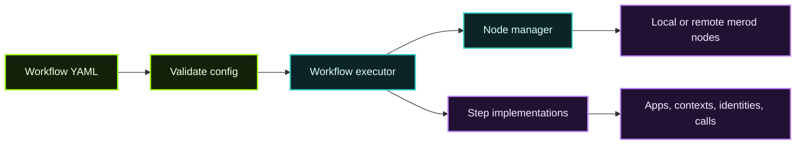

**Merobox** is a Python CLI for managing Calimero nodes and orchestrating multi-step workflows from YAML.

It is especially useful when you want to stand up a reproducible environment quickly without manually stitching together node lifecycle, auth, and application calls.

## What Merobox is best at

| Use case | Why Merobox fits |
| --- | --- |
| Local multi-node testing | Start multiple nodes together and inspect health |
| Workflow automation | Encode install, context, join, and call flows as YAML |
| Reproducible demos | Keep bootstrap steps versioned in one file |
| Integration testing | Reuse workflows in CI or pytest harnesses |
| Remote-node orchestration | Drive already running nodes through one tool |

## Typical commands

```bash
# Start two local nodes
merobox run --count 2

# Check status
merobox health

# Execute a YAML workflow
merobox bootstrap run workflow.yml

# Stop the cluster
merobox stop --all
```

## Workflow model

Merobox includes a workflow engine with validation and 35+ built-in step types.

**Core lifecycle:**
- `install_application` — install a WASM app on a node
- `create_context` — create a new context for an app
- `create_identity` — generate a context identity
- `join_context` — join a context on another node
- `call` — execute an application method
- `delete_context` — remove a context

**Namespace & group management:**
- `create_namespace`, `delete_namespace`
- `create_namespace_invitation`, `join_namespace`
- `create_group_in_namespace`, `delete_group`
- `add_group_members`, `remove_group_members`
- `get_group_info`
- `detach_context_from_group`
- `get_context_metadata`, `set_group_metadata`, `set_member_metadata`

**Upgrade & migration:**
- `upgrade_group` — upgrade a group to a new app version (`cascade: true` available)
- `cascade_namespace_application` — cascade an upgrade across a namespace
- `get_cascade_status` — query per-descendant migration status
- `assert_cascade_complete` — assert that a cascade migration has finished
- `abort_migration` — logically abort an in-flight namespace migration

**Authentication:**
- `login` — authenticate against a node's embedded auth router and cache the JWT
- `refresh` — refresh a cached JWT
- `ws_connect` — connect a WebSocket client and optionally send a message; use `unauthenticated: true` for negative tests
- `ws_subscribe` — subscribe to context events over WebSocket

**Network & topology:**
- `connect_node`, `disconnect_node`
- `partition_peers` — surgically partition libp2p peer connections (keeps RPC open)
- `heal_peers` — restore a previous partition
- `create_mesh` — connect nodes in a full mesh

**Flow control:**
- `parallel` — run steps concurrently
- `repeat` — repeat a step N times
- `wait` — sleep for a fixed duration
- `wait_for_sync` — poll with adaptive backoff until contexts converge
- `script` — run an arbitrary Python snippet
- `assert` — assert a condition on a captured output

That makes it a strong bridge between **one-off scripts** and a **full test harness**.

## Why builders use it

The biggest benefit of Merobox is that a workflow can capture a complete setup:

1. start nodes,
2. install an app,
3. create a context,
4. invite or join participants,
5. call methods,
6. assert that sync or state propagation happened.

In other words, it is a **scenario runner** for Calimero systems.

## Example mental model


```mermaid
flowchart LR
    YAML[Workflow YAML] --> VALIDATE[Validate config]
    VALIDATE --> EXEC[Workflow executor]
    EXEC --> NODES[Node manager]
    EXEC --> STEPS[Step implementations]
    NODES --> MEROD[Local or remote merod nodes]
    STEPS --> APPS[Apps, contexts, identities, calls]

    classDef lime fill:#14210a,stroke:#a5ff11,color:#f5ffe0,stroke-width:2px;
    classDef cyan fill:#0b2526,stroke:#39d0c8,color:#dcfffd,stroke-width:2px;
    classDef purple fill:#221133,stroke:#c084fc,color:#f7ecff,stroke-width:2px;

    class YAML,VALIDATE lime;
    class EXEC,NODES cyan;
    class STEPS,MEROD,APPS purple;
```

## Local and remote operation

From the source repo:

- you can run nodes in **Docker** mode,
- or manage **native binary** mode,
- and connect to **remote nodes** with credentials or API keys.

That flexibility makes Merobox useful both for local experiments and for more advanced staging or support workflows.

## NAT topology

Merobox supports simulating NAT network conditions for testing peer reachability in challenging environments:

```yaml
steps:
  - name: "Partition node-1 from node-2"
    type: partition_peers
    node: "node-1"
    targets: ["node-2"]

  - name: "Restore connectivity"
    type: heal_peers
    node: "node-1"
    targets: ["node-2"]
```

This is useful for testing gossip-based sync, key recovery, and migration convergence under network partitions. See `workflow-examples/workflow-nat-topology-cone-example.yml` for a full example.

## WebSocket auth testing

The `login`, `refresh`, `ws_connect`, and `ws_subscribe` steps enable end-to-end auth testing against nodes running with embedded auth:

```yaml
steps:
  - name: "Authenticate"
    type: login
    node: calimero-node-1
    username: alice
    password: password123

  - name: "WebSocket connects with a valid token"
    type: ws_connect
    node: calimero-node-1
    message: "ping"

  - name: "WebSocket without a token is rejected"
    type: ws_connect
    node: calimero-node-1
    unauthenticated: true
    expected_failure: true
```

## Merobox vs other tools

| Tool | Best for |
| --- | --- |
| `meroctl` | Day-to-day direct interaction with a node |
| Merobox | Multi-step orchestration and environment setup |
| Desktop | End-user install, launch, and local UX |
| MDMA / Cloud | Managed nodes and hosted operator workflows |

## When to reach for it

Use Merobox when you catch yourself writing shell scripts like:

- “start 3 nodes”
- “install this app on node 1”
- “create a context”
- “join node 2”
- “call a method 10 times”
- “wait for everyone to sync”

Merobox turns that into a versioned workflow instead of an ad hoc notebook of commands.

## Learn more

The repository links to a full external architecture reference covering:

- workflow engine internals,
- node management,
- remote nodes,
- CLI reference,
- testing and troubleshooting.

## Recommended next reads

- [CLI (meroctl)](/tools-apis/meroctl-cli/)
- [Developer Tools](/tools-apis/developer-tools/)
- [Operator Track](/operator-track/)
